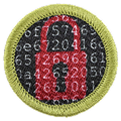

# Cybersecurity

Tyler Akins

Professional Programmer

<table width="30%"><tr><td>

</td></tr></table>

---

## Expectations

----

<!-- .slide: data-background="on-my-honor-coin.jpg" data-background-size="cover" -->

## Scout-Like Behavior
<!-- .element: style="background-color: rgba(0, 0, 0, 0.6)" -->

----

<!-- .slide: data-background="participation.jpg" data-background-size="contain" -->

## Participation is Expected
<!-- .element: style="background-color: rgba(0, 0, 0, 0.6)" -->

---

1a. View the Personal Safety Awareness "Digital Safety" video (with your parent or guardian's permission).

----

This is a requirement for Scout and Star ranks.

We're not doing it in class.

I still need *proof* that this was done.

---

1b. Explain to your counselor how to protect your digital footprint, such as while using social media, mobile device apps, and online gaming. Show how to set privacy settings to protect your personal information, including photos of yourself or your location.

----

## Social Media

* Set your profile to "Friends only"
* Disable location services
* Limit personal information

----

## Mobile Apps

* Only install from official app stores
* Check permissions before installing
* Regularly review and update app permissions

----

## Online Gaming

* Don't expose personal information in your username
* Avoid sharing personal details with other players
* Be cautious about accepting friend requests from strangers

---

1c. Discuss first aid and prevention for potential injuries, such as eye strain, repetitive injuries, and handling electronics devices, that could occur during repeated use. Discuss how to keep yourself physically safe while using a mobile device (for example while walking or biking).

----

## Eye Strain

* Follow the 20-20-20 rule: every 20 minutes, look at something 20 feet away for at least 20 seconds.
* Adjust screen brightness and contrast to comfortable levels.
* Use blue light filters or glasses to reduce eye strain.

----

## Repetitive Injuries

* Take regular breaks to stretch and move around.
* Use ergonomic equipment, such as a supportive chair and a keyboard at the right height.
* Maintain good posture while using devices.

----

## Handling Electronic Devices

* Avoid shock (plugged in or capacitor discharge).

----

## Physical Safety

* Avoid using devices while walking or biking
* Be aware of your surroundings - traffic, environment, etc.

----

<!-- .slide: data-background="walk-off-cliff.webp" data-background-size="contain" -->

---

2a. Relate three points of the Scout law to things people do on the internet or with computers, phones, and other connected electronic devices.

---

2b. Discuss with your counselor examples of ethical and unethical behavior in cyberspace. Include how to act responsibly when you encounter situations such as …

Explain why these situations require good judgement, and how the Scout Law and personal values should guide your actions.

----

… coming across an unattended or unlocked computer or mobile device

----

… observing someone type their password or seeing it written down near a computer

----

… or discovering a website that is not properly secured

---

3a. Describe three types of computer systems that need protecting and explain why.

----

Are there any computer systems that don't need protection?

----

My list:

* Personal computers and mobile devices
* Enterprise/business systems
* Critical infrastructure systems

---

3b. Explain the "C.I.A. Triad"—Confidentiality, Integrity, and Availability—and why these three principles are fundamental to cybersecurity.

6c3. Use a hashing tool (for example, using SHA or MD5) to create a checksum for a file, document, or piece of text. Have a fellow Scout or your counselor make a change to it, then recreate the checksum and compare the new checksum to the original as a demonstration of file integrity checking.

----

## Confidentiality

Ensuring that sensitive information is accessible only to authorized users.

Encryption, authentication, access controls

----

## Integrity

Maintaining the accuracy and trustworthiness of data, ensuring it cannot be altered or deleted without authorization.

Hashing, checksums, digital signatures

----

<hashing-demo></hashing-demo>

----

## Availability

Ensures that systems, services, and data remain accessible to authorized users when needed.

Redundancy, backups, disaster recovery planning

---

4a. Define the terms vulnerability, threat, and exploit, and give an example of each that might apply to a website or software product you use.

---

4b. Pick one type of malware (such as virus, worm, Trojan, backdoor, spyware, or ransomware) and find out how it works. Explain what it does and the harm it can cause.

4e1. Read an article or a news report about a recent cybersecurity incident, such as a data breach or malware infection. Explain how the incident happened (to the best of your ability based on the information available) and what the consequences are or might be to the victim.

----

A JavaScript worm disrupted Wikipedia after a malicious script hosted on Russian Wikipedia was executed during a security review of user-authored code. The script automatically injected JavaScript into user script files, the global common JavaScript file, and random pages. As other users viewed infected pages, the worm spread.

----

About 3,996 pages were modified and roughly 85 user scripts were overwritten. Wikimedia engineers temporarily disabled editing across Wikipedia projects, reverted the malicious changes, suppressed the altered pages and scripts from edit histories, and restored affected content. The code was active for about 23 minutes, and Wikimedia reported no evidence of an external attack or data breach.

----

The incident appears to have occurred when dormant malicious code was unintentionally activated during testing, and the foundation is continuing its investigation and implementing additional security safeguards.

----

Who could have been affected?

How bad could this have gotten?

---

4c. Identify two risks of using public Wi-Fi and describe how to reduce or avoid those risks.

---

4d. Describe what spoofing and phishing are, and how to recognize a message or website that might be trying to trick you. Explain what steps you should take to protect yourself and others if you come across one.
---

4f. Create a list of what is part of your cyber attack surface including all the ways someone could try to access your personal information or devices—such as online accounts, apps, or home networks.

---

5a. Describe three technologies that are used to defend a computer or network, such as access controls, antivirus software, firewall, intrusion detection/prevention systems, and Virtual Private Network.

---

5b1. Explain to your counselor the importance of installing the latest updates on your computer, why they are needed, and what kinds of problems they can prevent.

---

5b2. Demonstrate to your counselor how to check for, download, and install the latest updates for your computer or mobile device, or another computer you have permission to use (if you are unable to do this on your computer, you may use an online guide with screenshots to demonstrate this). Show your counselor how to verify that your computer or mobile device is up-to-date.

----

<!-- .slide: data-background="windows-update.jpg" data-background-size="contain" -->

----

<!-- .slide: data-background="mac-update-1.png" data-background-size="contain" -->

----

<!-- .slide: data-background="mac-update-2.png" data-background-size="contain" -->

----

<!-- .slide: data-background="mac-update-3.png" data-background-size="contain" -->

----

<!-- .slide: data-background="mac-update-4.png" data-background-size="contain" -->

----

<!-- .slide: data-background="ios-update-1.png" data-background-size="contain" -->

----

<!-- .slide: data-background="ios-update-2.png" data-background-size="contain" -->

----

<!-- .slide: data-background="ios-update-3.jpg" data-background-size="contain" -->

----

<!-- .slide: data-background="android-update.png" data-background-size="contain" -->

---

5c. System security. With your parent or guardian's permission, do THREE of the following using a computer or mobile device, and discuss with your counselor:

----

5c2. Describe multi-factor authentication (MFA) and how it can be used to improve security. Demonstrate how to use an authenticator app or other MFA function.

----

Access to ANY other device, account, or service

* Text messages
* Authenticator app
* Email
* Phone call

----

<totp-demo value="QWERTY"></totp-demo>
<totp-demo value="MOUSE2"></totp-demo>
<totp-demo value="QWERTY"></totp-demo>

----

5c7. Demonstrate how to back up your data from a mobile device to a local computer or the cloud.

----

* Dropbox, Google Drive, OneDrive, Apple iCloud
* Can do it manually by copying files to a local computer or external drive
* Can run your own service, such as NextCloud, Resilio Sync, Syncthing

----

But the requirement says "Demonstrate", so …

---

5c8. Research best practices for protecting a home computer or network, and make a checklist of FIVE things you and your family can do to stay secure.

----

* Firewall
* Keep the software updated
* Use different passwords for each system and service
* Do not run unverified software
* Use strong passwords

----

More about strong passwords:

https://rumkin.com/tools/password/

---

6a. Research and explain to your counselor three situations where encryption is used in cybersecurity. For each situation, describe what kind of encryption is used and why it is important.

----

* Webpages - public key encryption to establish a secure connection, then symmetric key encryption for the actual data transfer
* Passwords - usually hashed, but if retrieving the password is a requirement, then it is a symmetric key
* Tap to pay - cryptographic challenge and response goes with the encrypted communications to the payment provider

---

6b. Show how you can know if your connection to a website is encrypted.

----

<!-- .slide: data-background="check-if-secure.png" data-background-size="contain" -->

----

What does that mean? Is it safe for credit cards?

---

6c. Do ONE of the following:

We've done 6c3. We'll still discuss another.

----

6c2. Download and set up an app (from an official app store) that uses end-to-end encryption. Explain to your counselor what this means, how it works, and why it is more secure than other forms of communication (e.g. SMS).

----

SMS vs RCS

---

7. Connected Devices and Internet of Things (IoT). Describe to your counselor four electronic devices you encounter that could be connected to the internet, why this connectivity can be useful, what risks are posed by the connectivity, and how they could be protected.

---

8a. Learn about a cybersecurity competition, camp, or other activity you could participate in (either now or in the future). Share what you learned with your counselor, including the type of activity, time commitment, and age of participants.

----

<!-- .slide: data-background="defcon.webp" data-background-size="contain" -->

----

DEF CON CTF - Capture the Flag contest. Attendees are cybersecurity researchers, journalists, federal government agents, security professionals, students. 2019 prize money was $2 million.

Focus: cryptography, web exploitation, binary analysis, reverse engineering, forensics, and more.

----

What did they do here before?

----

Remotely took over a Jeep's computer, allowing full control of steering, brakes, transmission, etc.

----

ATM Jackpotting, where it just gives out as much money as you want.

----

Voting machine hacks; manipulating votes, the displayed candidates, and persisting changes across the network to other machines.

The hack took less than a second and could be done without attracting attention.

----

$57 tracker to see where people are even when they don't want to be tracked.

----

Hijacking satellite communications, medical devices, billboards

----

Reading laptop screens through walls

---

9. Careers. Do ONE of the following:

----

9a. Identify three career opportunities that would use skills and knowledge in cybersecurity. Pick one and research the training, education, certification requirements, experience, and expenses associated with entering the field. Research the prospects for employment, starting salary, advancement opportunities and career goals associated with this career. Discuss what you learned with your counselor and whether you might be interested in this career.

----

9b. Visit a business or organization that does work in cybersecurity. Find out about different work roles, what they do, and how they acquired their knowledge through college degrees or certifications. Share what you learned with your counselor.

---

That's it!

----

## Tyler Akins

612-387-8102  
fidian@rumkin.com

Email is for adults and for Scouts that have a current Cyber Chip.
<!-- .element style="color: red" -->
