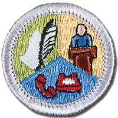
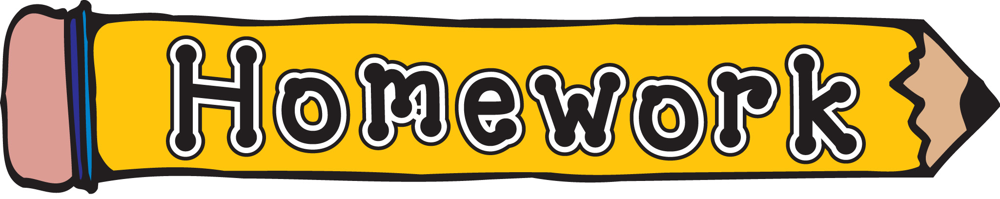
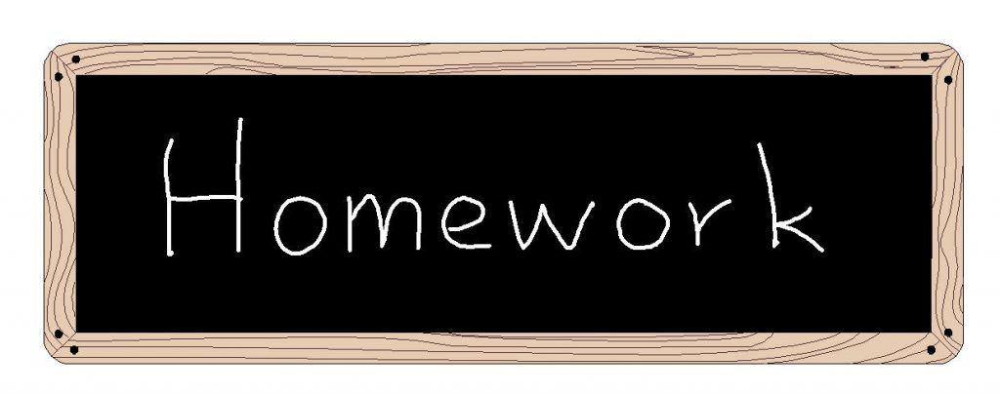
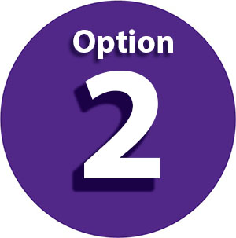

# Communication Merit Badge

Tyler Akins

---

## Expectations

----

<!-- .slide: data-background="on-my-honor-coin.jpg" data-background-size="cover" -->

## Scout-Like Behavior
<!-- .element: style="background-color: rgba(255, 255, 255, 0.5)" -->

Respectful and engaged, otherwise you will be asked to leave.
<!-- .element: style="background-color: rgba(255, 255, 255, 0.5)" -->

----

## Like College, Not High School

With college, you pay the instructor to teach. It's up to the student to learn.

----

## Not Prepared?

It's okay. Let me know, I make a note, and we will simply move on.

I'll try to help achieve as many requirements as possible.

----

## Action Verb

Each requirement has action verbs. "Describe," "prepare," "report," "interview," and other actions need to be performed.

Requirements must be met word for word.

----

## Participation Is Expected

----

## Out Of Order

The requirements will be addressed out of order. This is intentional for the flow of the session.

It is not designed to be cruel to you, but you'll be jumping around your notes a bit.

---

(2) Do ONE of the following:

----

(2b) Choose a concept, product, or service in which you have great confidence. Build a sales plan based on its good points. Try to persuade the counselor to agree with, use, or buy your concept, product or service. After your sales talk, discuss with your counselor how persuasive you were.
<!-- .element: style="font-size: 0.8em" -->

----

(2a) Think of a creative way to describe yourself using, for example, a collage, short story or autobiography, drawing or series of photographs, or a song or skit. Using the aid you created, make a presentation to your counselor about yourself.
<!-- .element: style="font-size: 0.8em" -->

---

(4) Interview someone you know fairly well, like, or respect because of his or her position, talent, career, or life experiences. Listen actively to learn as much as you can about the person. Then prepare and deliver to your counselor an introduction of the person as though this person were to be a guest speaker, and include reasons why the audience would want to hear this person speak. Show how you would call to invite this person to speak.
<!-- .element: style="font-size: 0.8em" -->

---

(5) Attend a public meeting (city council, school board, debate) approved by your counselor where several points of view are given on a single issue. Practice active listening skills and take careful notes of each point of view. Prepare an objective report that includes all points of view that were expressed, and share this with your counselor.
<!-- .element: style="font-size: 0.8em" -->

---

(7) Do ONE of the following:

----

(7a) Write to the editor of a magazine or your local newspaper to express your opinion or share information on any subject you choose. Send your message by fax, email, or regular mail.
<!-- .element: style="font-size: 0.8em" -->

----

(7b) Create a web page or blog of special interest to you (for instance, your troop or crew, a hobby, or a sport). Include at least three articles or entries and one photograph or illustration, and one link to some other web page or blog that would be helpful to someone who visits the web page or blog you have created. *It is not necessary to post your web page or blog to the Internet, but if you decide to do so, you must first share it with your parents and counselor and get their permission.*
<!-- .element: style="font-size: 0.8em" -->

----

(7c) Use desktop publishing to produce a newsletter, brochure, flier, or other printed material for your troop or crew, class at school, or other group. Include at least one article and one photograph or illustration.
<!-- .element: style="font-size: 0.8em" -->

---

(8) Plan a troop or crew court of honor, campfire program, or an interfaith worship service. Have the patrol leaders' council approve it, then write the script and prepare the program. Serve as master of ceremonies.
<!-- .element: style="font-size: 0.8em" -->

---

<!-- .slide: data-background="break-time.jpg" data-background-size="cover" -->

       

Requirements 3, 6, and 9 could be prepared during the break.
<!-- .element: style="background-color: rgba(255, 255, 255, 0.5)" -->

---

(3) Write a five-minute speech. Give it at a meeting of a group.

Notes:

This group counts.

---

(6) With your counselor's approval, develop a plan to teach a skill or inform someone about something. Prepare teaching aids for your plan. Carry out your plan. With your counselor, determine whether the person has learned what you intended.
<!-- .element: style="font-size: 0.8em" -->

Notes:

Can teach at this session.

---

(1) Do ONE of the following:

----

(1a) For one day, keep a log in which you describe your communication activities. Keep track of the time and different ways you spend communicating, such as talking person-to-person, listening to teachers, listening to the radio or podcasts, watching television, using social media, reading books and other print media, and using any electronic communication device. Discuss with your counselor what your log reveals about the importance of communication in your life. Think of ways to improve your communication skills.
<!-- .element: style="font-size: 0.8em" -->

----

(1b) For three days, keep a journal of your listening experiences. Identify one example of each of the following, and discuss with your counselor when you have listened to:
<!-- .element: style="font-size: 0.8em" -->

1. Obtain information 
2. Be persuaded 
3. Appreciate or enjoy something 
4. Understand someone's feelings

----

(1c) In a small-group setting, meet with other Scouts or with friends. Have them share personal stories about significant events in their lives that affected them in some way. Take note of how each Scout participates in the group discussion and how effectively each Scout communicates their story. Report what you have learned to your counselor about the differences you observed in effective communication.
<!-- .element: style="font-size: 0.8em" -->

Notes:

Will likely do this in advance because otherwise this portion can take a long time.

----

(1d) List as many ways as you can think of to communicate with others (face-to-face, by telephone, letter, email, text messages, social media, and so on). For each type of communication, discuss with your counselor an instance when that method might not be appropriate or effective.
<!-- .element: style="font-size: 0.8em" -->

---

## Careers

Notes:

Scouts provide the three careers. Counselor guesses. If right, Scout explains everything. If wrong, Scout shows work and is done.

----

(9) Find out about three career opportunities in communication. Pick one and find out the education, training, and experience required for this profession. Discuss this with your counselor, and explain why this profession might interest you.

---

# THE END

### Thank you!

----

Tyler Akins

<table><tr><td>

12650 130th Ave N 
Dayton, MN 55327

</td><td>

612-387-8102  
fidian@rumkin.com

</td></tr></table>

Email is for adults and for Scouts that have a current Cyber Chip. <!-- .element style="color: red" -->
