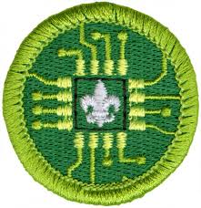
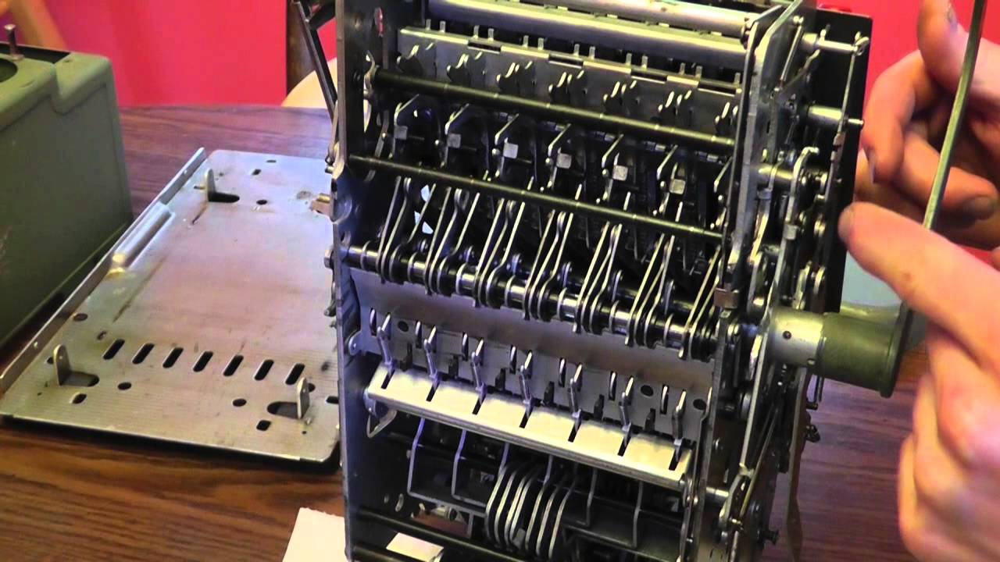
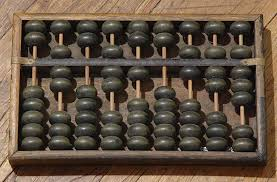
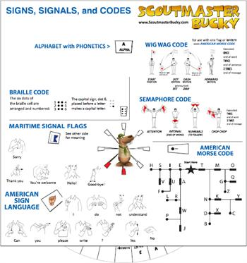
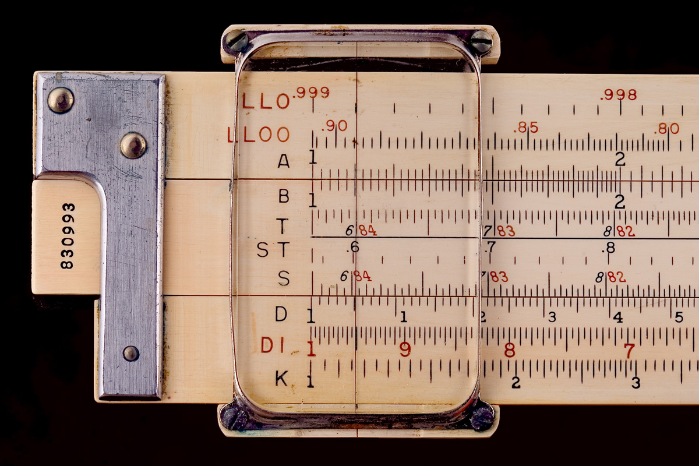
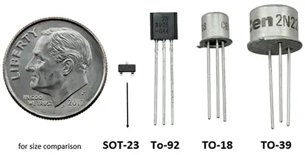
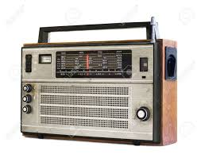
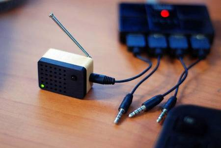
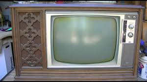
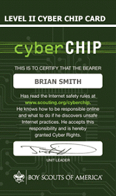

# Digital Technology Merit Badge

Tyler Akins

---

## Who am I?

Tyler Akins

Professionally programming since 1995

<table><tr><td>

12650 130th Ave N 
Dayton, MN 55327

</td><td>

612-387-8102  
fidian@rumkin.com

</td></tr></table>

ALWAYS INCLUDE A PARENT
<!-- .element style="color: red" -->

---

## Safety

1: View the Personal Safety Awareness “Digital Safety” video (with your parent or guardian’s permission).

---

## What is Digital Technology?

----

(Latin) <i>digitus</i>: finger or toe

(Latin) <i>-al</i>: being like

fingerlike

----

Something that performs a computation for us.

<table><tr><td>

</td><td width="33%">

</td><td width="33%">

</td></tr></table>

Notes:

Steam powered computer

Circuit board

Mechanical adding machine

----

Not these because they assist but don't compute.

<table><tr><td>

</td><td width="33%">

</td><td width="33%">

</td></tr></table>

----

Today we rely on transistors, not steam or mechanical force.

---

## Past and Present

2a: Give a brief history of the changes in digital technology over time. Discuss with your counselor how digital technology in your lifetime compares with that of your parents', grandparents', or other adults' lifetime.

----

## Radios

<table><tr><td width="33%">

</td><td width="33%">

</td><td>

</td></tr></table>

----

## Television

<table><tr><td width="33%">

</td><td width="33%">

</td><td>

</td></tr></table>

----

## Past and Present

2b: Describe the kinds of computers or devices you imagine might be available when you are an adult.

---

## Knowledge

3a: Explain to your counselor how text, sound, and pictures are digitized for storage.

----

<!-- .slide: data-background="keyboard.gif" data-background-size="contain" -->

## Text
<!-- .element: style="background-color: rgba(255, 255, 255, 0.5)" -->

Notes:

Signals on the keyboard start out as digital signals and end up encoded as Unicode, ASCII, or ANSI extended character set. Sometimes EBCDIC.

----

<!-- .slide: data-background="sound-digitization.png" data-background-size="contain" -->

Notes:

ADC - Analog to Digital Converter

DAC - Digital to Analog Converter

----

<!-- .slide: data-background="sound-wave.jpg" data-background-size="contain" -->

----

<!-- .slide: data-background="digital-camera.jpg" data-background-size="contain" -->

----

## Knowledge

3b: Describe the difference between lossy and lossless data compression, and give an example where each might be used.

----

<!-- .slide: data-background="lossless-vs-lossy-audio.png" data-background-size="contain" -->

----

<!-- .slide: data-background="lossless-vs-lossy-image.jpg" data-background-size="contain" -->

----

## Knowledge

3c: Describe two digital devices and how they are made more useful by their programming.

----

## Knowledge

3d: Discuss the similarities and differences between computers, mobile devices, and gaming consoles.

----

## Knowledge

3e: Explain what a computer network is and the difference between a local area network (LAN) versus a wide area network (WAN).

----

<!-- .slide: data-background="arpanet.jpg" data-background-size="contain" -->

---

## Software

4a: Explain what a program or software application or "app" is and how a computer uses a CPU and memory to execute it.

----

## Software

4b: Name four software programs or mobile apps you or your family use, and explain how each one helps you.

----

## Software

4c: Describe what malware is, and explain how to protect your digital devices and the information stored on them.

----

<!-- .slide: data-background="software-security.gif" data-background-size="contain" -->

---

## Internet

5a: Describe at least two different ways data can be transferred through the internet.

----

<!-- .slide: data-background="connected-to-internet.jpg" data-background-size="contain" -->

----

## Internet

5b: Using an internet search engine (with your parent’s permission), find ideas about how to conduct a troop court of honor or campfire program. Print out a copy of the ideas from at least three different websites.  Share what you found with your counselor, and explain how you used the search engine to find this information.

----

## Internet

5c: Use a Web browser to connect to an HTTPS (secure) website (with your parent's permission). Explain to your counselor how to tell whether the site's security certificate can be trusted, and what it means to use this kind of connection.

---

## Projects

6: Do THREE of the following. For each project you complete, copy the files to a backup device and share the finished projects with your counselor:

----

Easiest way to send files to me:

tinyurl.com/tyler-akins

----

6a: Using a spreadsheet or database program, develop a food budget for a patrol weekend campout OR create a troop roster that includes the name, rank, patrol, and telephone number of each Scout. Show your counselor that you can sort the roster by each of the following categories: rank, patrol, and alphabetically by name.

----

6b: Using a word processor, write a draft letter to the parents of your troop's Scouts, inviting them to a troop event.

----

6c: Using a graphics program, design and draw a campsite plan for your troop OR create a flier for an upcoming troop event, incorporating text and some type of visual such as a photograph or an illustration.

----

6d: Using a presentation software program, develop a report about a topic approved by your counselor. For your presentation, create at least five slides, with each one incorporating text and some type of visual such as a photograph or an illustration.

----

6e: Using a digital device, take a picture of a troop activity. Send or transfer this image to a device where the picture can be shared with your counselor.

----

6f: Make a digital recording of your voice, transfer the file to a different device, and have your counselor play back the recording.

----

6g: Create a blog and use it as an online journal of your Scouting activities, including group discussions and meetings, campouts, and other events. Include at least five entries and two photographs or illustrations. Share your blog with your counselor. You need not post the blog to the Internet; however, if you choose to go live with your blog, you must first share it with your parents AND counselor AND get their approval.

----

6h: Create a Web page for your troop, patrol, school, or place of worship. Include at least three articles and two photographs or illustrations. Include at least one link to a website of interest to your audience. You need not post the page to the Internet; however, if you decide to do so, you must first share the Web page with your parents AND counselor AND get their approval.

---

## Intellectual Property

7a: Explain to your counselor each of these protections and why they exist: copyright, patents, trademarks, trade secrets.

----

### Intellectual Property Protection

**Copyright** - Exclusive legal right granted to the originator to print, publish, perform, film, record material and to authorize others

**Patents** - Exclude others from making, using, selling an invention

**Trademarks** - Symbol or words registered to represent a company or product

**Trade Secrets** - Secret device or technique used by a company

Notes:

Copyright applies to basically any written or printed work, like books.

Patents apply to processes, like new ways to create medicines.

Trademarks are for symbols.

Trade secrets are not really protected by law, like the secret recipe for Coca-Cola.

----

## Intellectual Property

7b: Explain when it is permissible to accept a free copy of a program from a friend.

----

<table><tr><td>

Okay:

* Open Source
* Freeware
* Unregistered Shareware

</td><td>

Not okay:

* Anything you buy
* Most things you find

Maybe:

* Software you paid someone to produce
* Software you made

</td></tr></table>

----

## Intellectual Property

7c: Discuss with your counselor an article or (with your parent or guardian's permission) a report on the internet about a recent legal case involving an intellectual property dispute.

---

## Recycling

8: Do TWO of the following:

----

8a: Describe why it is important to properly dispose of digital technology. List at least three dangerous chemicals that could be used to create digital devices or used inside a digital device.

----

8b: Explain to your counselor what is required to become a certified recycler of digital technology hardware or devices.

----

8c: Do an Internet search for an organization that collects discarded digital technology hardware or devices for repurposing or recycling. Find out what happens to that waste. Share with your counselor what you found.

----

8d: Visit a recycling center that disposes of digital technology hardware or devices. Find out what happens to that waste. Share what you learned with your counselor.

----

8e: Find a battery recycling center near you and find out what it does to recycle batteries. Share what you have learned with your counselor about the proper methods for recycling batteries.

---

## Careers

9. Do ONE of the following

----

## Careers

9a: Investigate three career opportunities that involve digital technology. Pick one and find out the education, training, and experience required for this profession. Discuss this with your counselor, and explain why this profession might interest you.

----

## Careers

9b: Visit a business or an industrial facility that uses digital technology. Describe four ways digital technology is being used there. Share what you learned with your counselor.

---

<table><tr><td width="30%">

</td><td>

## Cyber Chip

This part covers the Level II Cyber Chip, which is for Scouts BSA

Section A is for grades 6-8

Section B is for grades 9-12

</td></tr></table>

Notes:

Some requirements need to be completed with a parent. Others can be done here, and others should be done with your patrol or troop.

----

### Internet Safety Pledge

1. I will think before I post

2. I will respect other people online

3. I will respect digital media ownership

4. I won't meet face-to-face with anyone I meet in the digital world unless I have my parent's permission

5. I will protect myself online

Notes:

This is on the Cyber Chip. This is a commitment you are making and you should think about it first. If you agree, sign inside the shaded box on the Cyber Chip card.

----

### Teach Another Patrol

Teach Internet safety rules, behavior and "netiquette" to another group

Use the EDGE method and mini lessons 
Explain, Demonstrate, Guide, Enable

Each member must have a role and present part of the lesson

Notes:

* Explain - Cover the steps. Visual aids. Ask questions to engage audience.
* Demonstrate - Use actual materials.
* Guide - Guide and coach as they practice.
* Enable - Let them demonstrate or teach the skill.

----

### Discuss With Your Scout Leader

* When does your troop permit and restrict electronic devices?
* When are acceptable times to use these devices?
* What happens when people use cell phones or tablets at inappropriate times?

----

### The Rest of the Cyber Chip

The rest is up to you and your parents or guardians.

Any unit leader can sign off on the Cyber Chip.

You must earn the Cyber Chip before the Digital Technology Merit Badge can be earned.

---

# THE END

### Thank you!

*You survived!* <!-- .element style="font-size: 0.6em" -->

----

Tyler Akins

<table><tr><td>

12650 130th Ave N 
Dayton, MN 55327

</td><td>

612-387-8102  
fidian@rumkin.com

</td></tr></table>

Email is for adults and for Scouts that have a current Cyber Chip. <!-- .element style="color: red" -->
