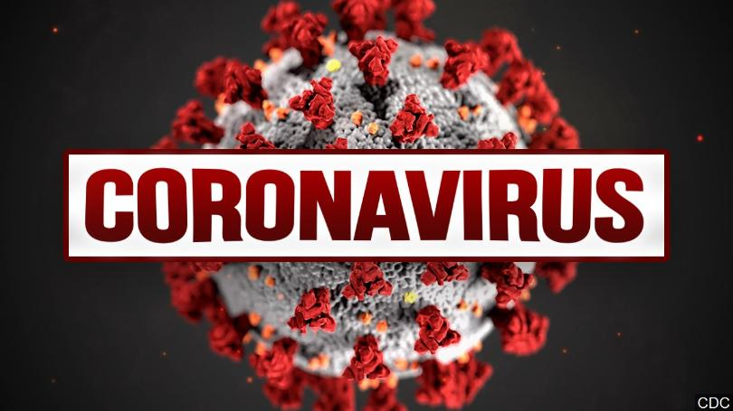
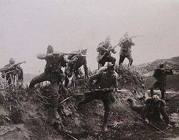
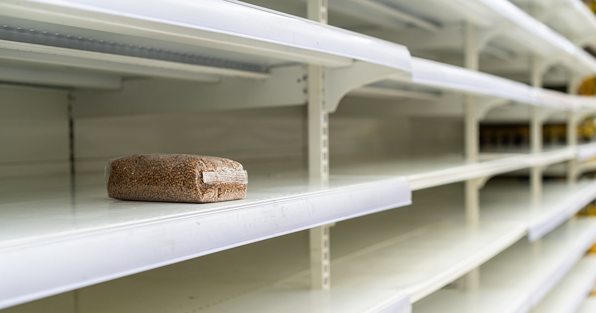
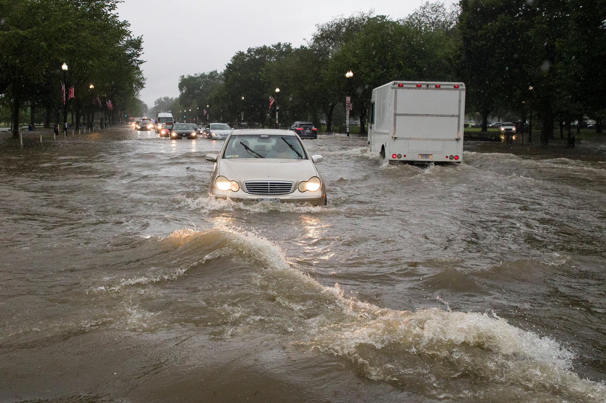
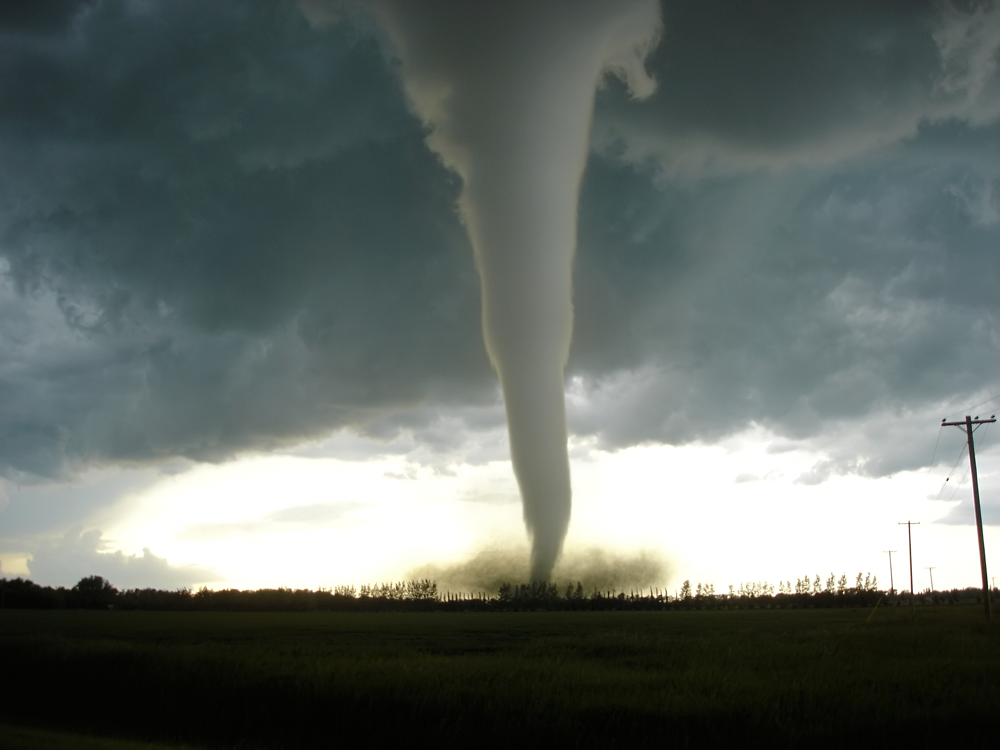
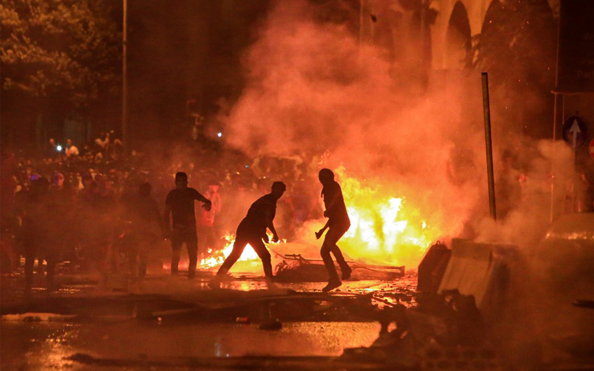
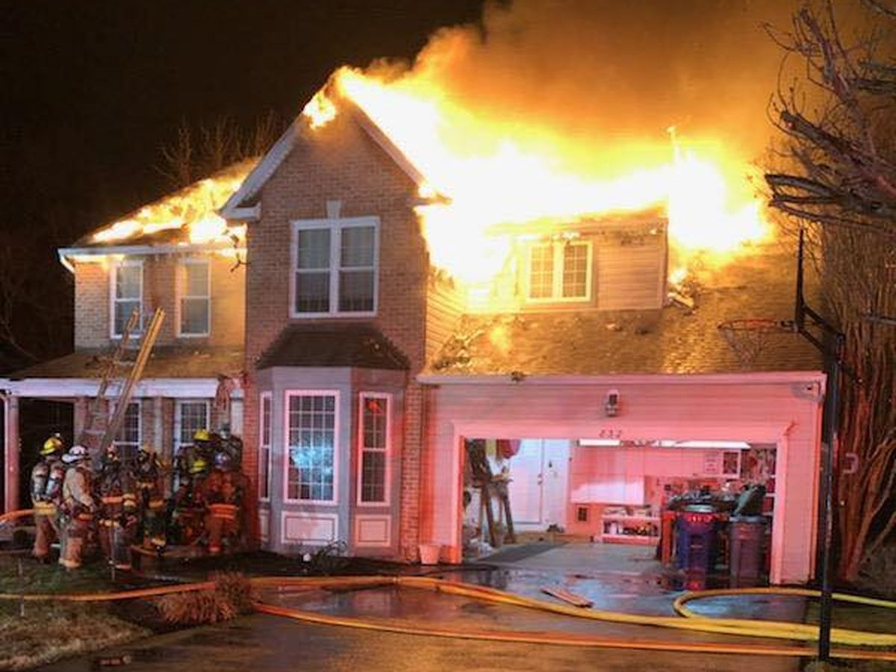
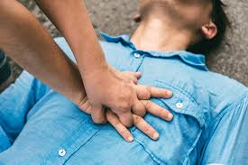
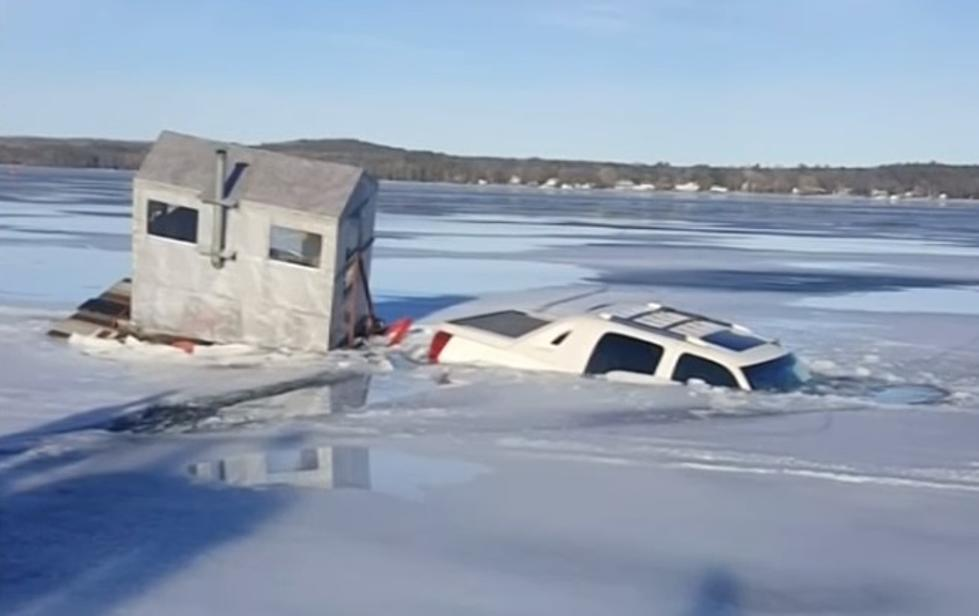

# Emergency Preparedness

Tyler Akins

<table width="30%"><tr><td>

</td></tr></table>

---

## Who am I?

Tyler Akins

612-387-8102  
fidian@rumkin.com

Email is for adults and for Scouts that have a current Cyber Chip.
<!-- .element style="color: red" -->

---

## Expectations

----

<!-- .slide: data-background="on-my-honor-coin.jpg" data-background-size="cover" -->

## Scout-Like Behavior
<!-- .element: style="background-color: rgba(255, 255, 255, 0.5)" -->

Respectful and engaged, otherwise you will be asked to leave.
<!-- .element: style="background-color: rgba(255, 255, 255, 0.5)" -->

----

## It's Up To You

I offer the merit badge and allow you to complete the work. I do not complete the work for you.

----

## Not Prepared?

It's okay. Let me know, I make a note, and we will simply move on.

I'll try to help achieve as many requirements as possible.

----

## Action Verb

Each requirement has action verbs. "Describe," "discuss," "prepare," "report," "interview," and other actions need to be performed.

Requirements must be met word for word.

----

## Ethics

Scouts are expected to have done their own work. It is immoral to claim another person's work as your own. This includes:

* Making your own kit instead of entirely relying on a pre-made emergency kit.

* Writing your own words instead of copying and pasting.

----

## Participation Is Expected

---

### What Is An Emergency?

----

<i>A serious, unexpected, and often dangerous situation requiring immediate action.</i>

----

### What are some examples?

* Global
* National
* Regional
* Local

----

## Global Emergencies

<table><tr><td width="33%">

</td><td width="33%">

</td><td width="50%">

</td></tr></table>

Notes:

* Disease
* Climate change
* Nuclear reactor explosions

----

## National Emergencies

<table><tr><td width="33%">

</td><td width="33%">

</td><td>

</td></tr></table>

Notes:

* War
* Economic or trade emergencies

----

## Community and Regional Emergencies

<table><tr><td width="33%">

</td><td width="33%">

</td><td>

</td></tr></table>

Notes:

* Flood
* Tornado
* Riots
* Earthquake
* Hazardous chemicals
* Pirates

----

## Localized Emergencies

<table><tr><td width="33%">

</td><td width="33%">

</td><td>

</td></tr></table>

Notes:

* House on fire
* CPR
* Active shooter
* Car accident
* Ingestion of poison
* Gas leak
* Explosion
* Lost or stranded in dangerous weather

---

## First Aid

1: Earn the First Aid merit badge.

----

<!-- .slide: data-background="first-aid-merit-badge.jpg" data-background-size="contain" -->

## On Your Own
<!-- .element style="background-color: rgba(255, 255, 255, 0.5)" -->

It's outside the scope of this merit badge to teach you the necessary lifesaving skills.
<!-- .element style="background-color: rgba(255, 255, 255, 0.5)" -->

---

## Planning and Aspects

2: Do the following:

2a: Discuss with your counselor the aspects of emergency preparedness: prevention, protection, mitigation, response, recovery.

Include in your discussion the kinds of questions that are important to ask yourself as you consider each of these.

----

## Prevention

Avoiding the problem is the safest course of action.

**What questions would you ask?**

----

## Prevention Questions

* What types of emergencies are possible?
* Which of those are more likely?
* What hazards need to be considered?

----

## Protection

Protect against the greatest threats and hazards, while allowing our way of life to thrive.

----

## Protection Questions

* What plans do we need?
* Have we practiced our plan lately?
* Do we have a disaster kit and is it current?
* Are there warning systems or devices?

Notes:

Smoke detectors are warning devices.

----

## Mitigation

We will come back to this.

----

## Response

STOP: Stop, Think, Observe, Plan

First Aid.

Focus on your task.

Respond quickly to save lives, protect property and equipment, and meet basic human needs.

Notes:

Avoid chaos and panic. Speak clearly. Ensure people know what's going on and direct them to best help the situation.

----

## Response Questions

* What kinds of medical care should be handled?
* Do you need shelter, and what kind of shelter?
* Is there food and water?
* Should people be evacuated?

----

## Recovery

Get back to normal.

Rebuild, repair, heal, console.

----

## Recovery Questions

* How do we rebuild?
* Can people be consoled or counseled to return to a normal life?
* What is the process?

----

## Back to Mitigation

Lessen the impact of the next emergency by taking action now.

It's **taking an action** to see if you can improve any of the other four aspects.

----

## Mitigation Questions

* What additional threats can be avoided?
* How can we be more prepared?
* If a problem happens, how can we ensure a more timely response and recovery?

Notes:

Taking this class can be seen as a mitigation step. Checklists, audits, and annual reviews are also mitigation steps.

The important part is that it is an action you are taking.

---

## Planning and Aspects

2: Do the following:

2b: Using a chart, graph, spreadsheet, or another method approved by your counselor, demonstrate your understanding of each aspect of emergency preparedness listed in requirement 2a for 10 emergency situations from the list below. Discuss your findings with your counselor.

----

## Let's be REAL CLEAR

Using a chart, graph, spreadsheet, or another method approved by your counselor, demonstrate your understanding of each aspect of emergency preparedness listed in requirement 2a for 10 emergency situations from the list below. Discuss your findings with your counselor.

----

## Ethics Again

All work needs to be your own. Don't try to claim someone else's worksheet chart as your own.

Use your own words, not someone else's.

----

## Why Not Copy And Paste?

"Privilege escalation threat modeling revealed race conditions triggering edge-case memory overflows."

You can copy and paste it, but you that doesn't mean you can demonstrate your understanding of the words.

----

You must use these five situations. Discuss prevention, protection, mitigation, response, recovery.

1. Home kitchen fire
2. Home basement / storage room / garage fire
3. Explosion in the home
4. Automobile crash
5. Food-borne disease (food poisoning)

----

Pick 5 more from this list. Discuss prevention, protection, mitigation, response, recovery.

----

6. Fire or explosion in a public place <!-- .element: style="font-size: 0.80em" -->
7. Vehicle stalled in the desert <!-- .element: style="font-size: 0.80em" -->
8. Vehicle trapped in a blizzard <!-- .element: style="font-size: 0.80em" -->
9. Earthquake or tsunami <!-- .element: style="font-size: 0.80em" -->
10. Mountain / backcountry accident <!-- .element: style="font-size: 0.80em" -->
11. Boating or water accident <!-- .element: style="font-size: 0.80em" -->
12. Gas leak in a home or a building <!-- .element: style="font-size: 0.80em" -->
13. Tornado or hurricane <!-- .element: style="font-size: 0.80em" -->
14. Major flooding or a flash flood <!-- .element: style="font-size: 0.80em" -->
15. Toxic chemical spills and releases <!-- .element: style="font-size: 0.80em" -->
16. Nuclear power plant emergency <!-- .element: style="font-size: 0.80em" -->
17. Avalanche (snowslide or rockslide) <!-- .element: style="font-size: 0.80em" -->
18. Violence in a public place <!-- .element: style="font-size: 0.80em" -->

---

## Planning and Aspects

2: Do the following:

2c: Meet with and teach your family how to get or build a kit, make a plan, and be informed for the situations on the chart you created for requirement 2b. Complete a family plan. Then meet with your counselor and report on your family meeting, discuss their responses, and share your family plan.

Notes:

Do not focus on the kit itself at this point. It comes up again later.

---

3: Show how you could save a person from the following without putting yourself in danger:

----

<!-- .slide: data-background="live-household-wire.jpg" data-background-size="contain" -->

3a: Touching a live household wire
<!-- .element style="background-color: rgba(255, 255, 255, 0.5)" -->

Notes:

* Never use a metal or wet object.
* Call 911.
* Start CPR immediately if victim is not breathing.

----

<!-- .slide: data-background="carbon-monoxide.jpg" data-background-size="contain" -->

3b: A structure   filled with   carbon monoxide
<!-- .element style="background-color: rgba(255, 255, 255, 0.5)" -->

Notes:

Headache, nausea, dizziness, breathlessness, collapse, loss of consciousness

Get outside ASAP. Evacuate everyone from structure. Open windows if unable to leave. Turn off any source of combustion. Call 911. Rescue breathing if necessary.

----

<!-- .slide: data-background="clothes-on-fire.jpg" data-background-size="contain" -->

3c: Clothes on fire
<!-- .element style="background-color: rgba(255, 255, 255, 0.5)" -->

Notes:

* Stop - stop running.
* Drop - lay down.
* Cover - hide your face.
* Roll - smother the fire.
* Cool immediately for 10-15 minutes

----

<!-- .slide: data-background="drowning.jpg" data-background-size="contain" -->

3d: Drowning using nonswimming rescues
<!-- .element style="background-color: rgba(255, 255, 255, 0.5)" -->

Notes:

* Reach
* Throw
* Row - avoid canoes
* Don't go, unless trained
* Stop rescue if risk is unacceptable

----

<!-- .slide: data-background="drowning-under-ice.jpg" data-background-size="contain" -->

3d: ... (including accidents on ice)
<!-- .element style="background-color: rgba(255, 255, 255, 0.5)" -->

Notes:

* Reach
* Throw
* Go, carefully, laying on ice, reaching with a stick

---

4: Show three ways of attracting and communicating with rescue planes / aircraft.

----

<!-- .slide: data-background="body-signals.gif" data-background-size="contain" -->

----

<!-- .slide: data-background="ground-to-air.jpg" data-background-size="contain" -->

----

<!-- .slide: data-background="air-seeing-signal.jpg" data-background-size="contain" -->

Notes:

Arrow was made from two mylar blankets cut in half. The trunk of the arrow is about 2 feet wide and 14 feet long.

----

<!-- .slide: data-background="grand-canyon-rescue.png" data-background-size="contain" -->

----

<!-- .slide: data-background="grand-canyon-rescue-air.png" data-background-size="contain" -->

----

<!-- .slide: data-background="walkie-talkie.jpg" data-background-size="contain" -->

----

<!-- .slide: data-background="signal-mirror.jpg" data-background-size="contain" -->

----

<!-- .slide: data-background="signal-fire.jpg" data-background-size="contain" -->

Notes:

* 3 large fires in a triangle or in a line, visible, 25 yards between
* Prepare ahead of time and protect them

----

<!-- .slide: data-background="smoke-from-air.jpg" data-background-size="contain" -->

----

<!-- .slide: data-background="smoke-from-air2.jpg" data-background-size="contain" -->

Notes:

* Most natural materials burn with white smoke.
* Man-made synthetic materials burn with black smoke.

----

<!-- .slide: data-background="chemlight.jpg" data-background-size="contain" -->

Notes:

Chemlight on paracord swung around head to make a larger, visible signal.

---

5: With another person, show a good way to transport an injured person out of a remote and/or rugged area, conserving the energy of rescuers while ensuring the well-being and protection of the injured person.

----

<!-- .slide: data-background="firemans-carry.svg" data-background-size="contain" -->

Notes:

Fireman's carry

----

<!-- .slide: data-background="supporting-carry.svg" data-background-size="contain" -->

Notes:

Supporting carry

Victim must be able to walk or hop

----

<!-- .slide: data-background="arms-carry.svg" data-background-size="contain" -->

Notes:

Arms carry

Short distance

----

<!-- .slide: data-background="saddleback-carry.svg" data-background-size="contain" -->

Notes:

Saddleback carry

Victim must hold on to the bearer's neck

----

<!-- .slide: data-background="pack-strap-carry.svg" data-background-size="contain" -->

Notes:

Pack-Strap carry

Moderate distance. Hold victim's arms with palms down. Stand as erect as possible after positioning victim.

----

<!-- .slide: data-background="two-person-support-carry.svg" data-background-size="contain" -->

Notes:

Two-person support carry

Can use victim's belt if need to drag unconscious person to safety.

----

<!-- .slide: data-background="two-person-arms-carry.svg" data-background-size="contain" -->

Notes:

Two-person arms carry

Moderate distance. Carry victim high and close to chest. When there's no time for a spine board, this is the safest for transporting a person with a back injury, especially if additional people hold head and legs in alignment.

----

<!-- .slide: data-background="three-person-arms-carry.svg" data-background-size="contain" -->

Notes:

Three-person arms carry

More people makes this easier.

----

<!-- .slide: data-background="two-person-fore-and-aft-carry.svg" data-background-size="contain" -->

Notes:

Two-person fore and aft carry

Long distance. Taller person should be in back.

----

<!-- .slide: data-background="three-person-fore-and-aft-carry.svg" data-background-size="contain" -->

Notes:

Three-person fore and aft carry (Wheelbarrow carry)

Long distance. Requires a wide path and not suitable for one track paths.

----

<!-- .slide: data-background="two-person-four-hand-seat-carry.svg" data-background-size="contain" -->

Notes:

Two-person four-hand seat carry

Conscious victim must hold onto rescuer's shoulders. Moderate distance.

----

<!-- .slide: data-background="two-person-two-hand-seat-carry.svg" data-background-size="contain" -->

Notes:

Short distance.

----

<!-- .slide: data-background="improvised-stretcher.png" data-background-size="contain" -->

----

<!-- .slide: data-background="improvised-stretcher.gif" data-background-size="contain" -->

----

<!-- .slide: data-background="improvised-splint.jpg" data-background-size="contain" -->

Notes:

The best method is where the victim uses their own energy to move. It saves a tremendous amount of energy for the rescuers.

---

6: Do the following:

6a: Describe the National Incident Management System (NIMS) and the Incident Command System (ICS).

----

## National Incident Management System (NIMS)

Helps government at all levels work together to prepare for, prevent, respond to, recover from, and mitigate the effects of incidents regardless of the incident's cause, size, location, or complexity.

* Shared processes (playbook)
* Shared vocabulary
* Defined operational systems during incidents (like ICS)

----

## 14 NIMS Management Characteristics

<ol style="column-count: 2; font-size: 0.8em">
<li>Common Terminology</li>
<li>Modular Organization</li>
<li>Management by Objectives</li>
<li>Incident Action Planning</li>
<li>Manageable Span of Control</li>
<li>Incident Facilities and Locations</li>
<li>Comprehensive Resource Management</li>
<li>Integrated Communications</li>
<li>Establishment and Transfer of Command</li>
<li>Unified Command</li>
<li>Chain of Command and Unity of Command</li>
<li>Accountability</li>
<li>Dispatch/ Deployment</li>
<li>Information and Intelligence Management</li>
</ol>

----

## Incident Command System (ICS)

Provides effective, cross-jurisdictional coordination with a standardized, hierarchical structure.

* Organizational "best practices"
* Works across agencies, both within and outside of government
* Ensures most pressing needs are met and resources are not wasted

----

## Role of ICS

* Establishes planning and management functions
* Uses common terminology
* Integrates communication media
* Coordinates resource management and allocation
* Handles planning
* Creates unified command structure

----

# NIMS vs ICS

*NIMS requires that responses to all domestic incidents utilize a common management structure. The Incident Command System—or ICS—is a standard, on-scene, all-hazard incident management concept.*

U.S. Department of Agriculture

----

6b: Identify the government or community agencies that normally handle and prepare for emergency services similar to those of the NIMS or ICS.

Notes:

* Hennepin County, and each city's Emergency Operation Plan.
* National Weather Service Twin Cities.
* Federal Emergency Management Agency.

----

6b: (continued) Explain to your counselor one of the following:

1. How the NIMS/ICS can assist a Scout troop when responding in a disaster.
2. How a group of Scouts could volunteer to help in an event of these types of emergencies.

----

6c: Find out who is your community's emergency management director and learn what this person does to prevent, protect, mitigate, respond to, and recover from emergency situations in your community. Discuss this information with your counselor, utilizing the information you learned from requirement 2b.

----

* City of Minneapolis - Bryan Gorman
* Hennepin County - Eric Waage
* U of M - Katharine Bonneson
* Anoka County - Terry Stoltzman
* Washington County - Doug Berglund
* State of Minnesota - Kristi Rollwagen

---

7: Do the following:

7a: Take part in an emergency service project, either a real one or a practice drill, with a Scouting unit or a community agency.

----

7b: Prepare a written plan for mobilizing your troop when needed to do emergency service. If there is already a plan, explain it. Tell your part in making it work.

----

Mobilization Plan

* How you inform everyone
* When and where you meet
* How work is determined and distributed
* How to monitor participants
* Additional needs (food, bathroom, water, stress)
* When to end

----

Example for a burning house, mid 1800's:

* Send runners down the street to seek help
* People show up with buckets
* Organizer puts them into a bucket brigade
* Organizer decides what is of most value to save
* Those closest to fire are monitored for their health
* Organizer determines when emergency is over

---

8: Do the following:

8a: Tell the things a group of Scouts should be prepared to do, the training they need, and the safety precautions they should take for the following emergency services:

1. Crowd and traffic control.
2. Messenger service and communications.
3. Collection and distribution services.
4. Group feeding, shelter, and sanitation.

----

8b: Prepare a personal emergency service pack for a mobilization call. Prepare a family emergency kit (suitcase or waterproof box) for use by your family in case an emergency evacuation is needed. Explain the needs and uses of the contents.

----

<!-- .slide: data-background="kit.jpg" data-background-size="contain" -->

## My Kit
<!-- .element style="background-color: rgba(255, 255, 255, 0.5)" -->

Notes:

I'll go over the major groupings of items in my pack.

----

<!-- .slide: data-background="kit-first-aid-and-medicines.jpg" data-background-size="contain" -->

## First Aid and Medicines
<!-- .element style="background-color: rgba(255, 255, 255, 0.5)" -->

----

<!-- .slide: data-background="kit-shelter-and-protection.jpg" data-background-size="contain" -->

## Shelter and Protection
<!-- .element style="background-color: rgba(255, 255, 255, 0.5)" -->

Notes:

Heavy duty garbage bag as a raincoat or shelter.

----

<!-- .slide: data-background="kit-water-and-food.jpg" data-background-size="contain" -->

## Water and Food
<!-- .element style="background-color: rgba(255, 255, 255, 0.5)" -->

Food is much less important.
<!-- .element style="background-color: rgba(255, 255, 255, 0.5)" -->

Notes:

Purification tablets plus a water filter. Two separate systems that will work.

----

<!-- .slide: data-background="kit-fire.jpg" data-background-size="contain" -->

## Fire
<!-- .element style="background-color: rgba(255, 255, 255, 0.5)" -->

Notes:

Three different ways to start fires, plus emergency tinder. Most are waterproof.

* Lighter + cotton balls rubbed in Vasoline
* Flint + magnesium bar (magnesium is tinder)
* Flint wheel + Tinder Quick

----

<!-- .slide: data-background="kit-cooking.jpg" data-background-size="contain" -->

## Cooking
<!-- .element style="background-color: rgba(255, 255, 255, 0.5)" -->

----

<!-- .slide: data-background="kit-tools.jpg" data-background-size="contain" -->

## Tools
<!-- .element style="background-color: rgba(255, 255, 255, 0.5)" -->

----

<!-- .slide: data-background="kit-hygiene.jpg" data-background-size="contain" -->

## Hygiene
<!-- .element style="background-color: rgba(255, 255, 255, 0.5)" -->

----

<!-- .slide: data-background="kit-communication.jpg" data-background-size="contain" -->

## Communication and Lighting
<!-- .element style="background-color: rgba(255, 255, 255, 0.5)" -->

----

<!-- .slide: data-background="kit-assembled.jpg" data-background-size="contain" -->

## My Kit
<!-- .element style="background-color: rgba(255, 255, 255, 0.5)" -->

---

9: Do one of the following:

9a: Using a safety checklist approved by your counselor, inspect your home for potential hazards. Explain the hazards you find and how they can be corrected.

----

Or

9b: Review or develop a plan of escape for your family in case of fire in your home.

----

Or

9c: Develop an accident prevention program for five family activities outside the home (such as taking a picnic or seeing a movie) that includes an analysis of possible hazards, a proposed plan to correct those hazards, and the reasons for the corrections you propose.

---

# THE END

### Thank you!

*You survived!*
<!-- .element style="font-size: 0.6em" -->

----

Tyler Akins

<table><tr><td>

12650 130th Ave N 
Dayton, MN 55327

</td><td>

612-387-8102  
fidian@rumkin.com

</td></tr></table>

Email is for adults and for Scouts that have a current Cyber Chip.
<!-- .element style="color: red" -->
