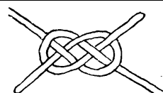
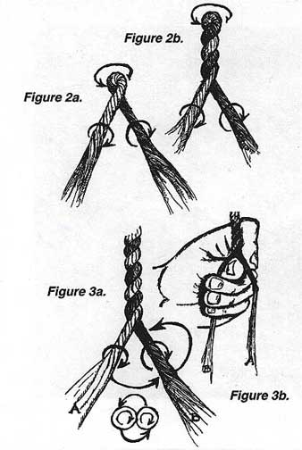
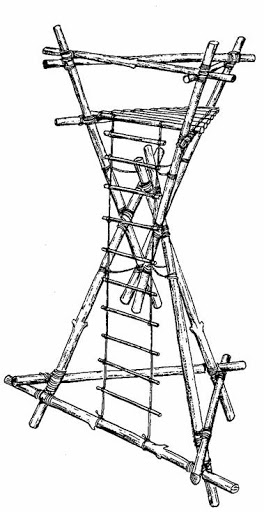

# Pioneering Merit Badge

Tyler Akins

<table width="30%"><tr><td>

</td></tr></table>

Notes:

Bring pioneering kit!

---

## Who am I?

Tyler Akins

Pioneering Merit Badge Counselor

612-387-8102  
fidian@rumkin.com

Email is for adults and for Scouts that have a current Cyber Chip.
<!-- .element style="color: red" -->

----

## Who am I?

Learned and used knots at an early age.

Father owned a nursery and tree care business, grandfather was in the navy.

Lived in a woods and built structures.

----

<!-- .slide: data-background="igkt-logo.png" data-background-size="contain" -->

A worldwide association for people with an interest in knots and knot tying. <!-- .element: style="background-color: #ffffffaf" -->

----

Working on earning the world record for the smallest nautical knot board.

<table style="width: 30%"><tr><td align=center>

</td></tr></table>

---

## What is Pioneering?

Can anyone here define it?

Why does the BSA continue to promote it since its start in 1911?

Notes:

Problem solving skills, teamwork.

----

<!-- .slide: data-background="pioneering-example1.jpg" data-background-size="contain" -->

----

<!-- .slide: data-background="catapult.jpg" data-background-size="contain" -->

----

<!-- .slide: data-background="battering-ram-gate.jpg" data-background-size="contain" -->

----

<!-- .slide: data-background="pioneering-example2.jpg" data-background-size="contain" -->

----

## Dictionary Definition

> (adj) involving new ideas or methods. "his pioneering work on consciousness"

> (adj) relating to or being a pioneer, especially characteristic of early settlers or their time.

----

## Wikipedia: Pioneering (scouting)

The art of using ropes and wooden spars joined by lashings and knots to create a structure, from camp gadgets to bridges and towers.

Name comes from 18th and 19th century military engineers who went ahead of an army to "pioneer" a route, which could involve building bridges and towers with rope and timber.

---

## Safety (Part 1)

1a: Explain to your counselor the most likely hazards you might encounter while participating in pioneering activities and what you should do to anticipate, help prevent, mitigate, and respond to these hazards.

----

## Safety (Part 2)

1b: Discuss the prevention of, and first aid treatment for, injuries and conditions that could occur while working on pioneering projects, including rope splinters, rope burns, cuts, scratches, insect bites and stings, hypothermia, dehydration, heat exhaustion, heatstroke, sunburn, and falls.

----

## Guide to Safe Scouting

Pioneering projects, such as monkey bridges, have a maximum height of 6 feet. Close supervision should be followed when Scouts are building or using pioneering projects.

Safe Swim Defense applies to other nonswimming activities whenever participants enter water over knee deep or when submersion is likely, for example, when fording a stream, seining for bait, or constructing a bridge as a pioneering project.

---

## Pay Attention to Details

People get knots wrong all the time.

Even experts.

It's okay.

Be patient. Take your time.

Carefully confirm each step.

----

It's okay to get things wrong!

> Wrong ≠ Bad <!-- .element: style="font-size: 2em" -->

You didn't succeed ***yet***.

Notes:

It took me until I was 15 until I understood it and stopped tying slipped granny knots.

----

<table><tr><td colspan=2 align=center>

Naming Knots - this is just the "Carrick Bend" because there's no "Single Carrick Bend".

</td></tr><tr><td align=center>

BSA's "Forty Knots" card (97% correct)

</td><td align=center>

Ashley Book of Knots

</td></tr></table>

Notes:

Define: STANDING / WORKING END

Can you see which ends are working ends?

----

<table><tr><td align=center>

BSA's "Forty Knots" card (95% correct)

</td><td align=center width="50%">

This "Sailor's Knot" is really a "cow hitch" or "reversed half hitches."

</td><td align=center>

Ashley Book of Knots

</td></tr></table>

Notes:

This is a variant of a Lark's Head.

Animals are tethered with it because it comes undone with frantic pulling. Sailors won't use this.

----

## If names are hard, what about the knots themselves?

> Surely the BSA can get them right!

----

Midshipman's Knot or Rolling Hitch

<table><tr><td align=center>

</td><td align=center>

BSA's Forty Knots card (wrong, 90% correct)

</td><td align=center>

</td></tr><tr><td align=center>

</td><td align=center>

Ashley Book of Knots

</td><td align=center>

</td></tr></table>

Notes:

Midshipman's Hitch is tied onto a rope. Rolling hitch is tied to a spar.

----

Anchoring, Pioneering merit badge pamphlet

<table><tr><td align=center>

2009: top is a half hitch, bottom is a cow hitch with seizing

</td><td align=center>

2019: neither are knots and both look more like springs

</td></tr></table>

Notes:

Define ROUND, TURN, ROUNDTURN

----

<table><tr><td align=center>

 
2009 (Wrong) 

</td><td align=center>

 
2019 (Right)

</td></tr></table>

Lashings, Pioneering merit badge pamphlet

Notes:

Fraps are wrong.

----

<table><tr><td align=center>

 
2009 (Wrong)

</td><td align=center>

 
2019 (Right)

</td></tr></table>

Lashings, Pioneering merit badge pamphlet

Notes:

Insufficient detail, picture shows two rows and diagram implies a single loop.

----

<table><tr><td align=center>

 
2009 (Wrong)

</td><td align=center>

 
2019 (Right)

</td></tr></table>

Lashings, Pioneering merit badge pamphlet

Notes:

Don't weave over/under. Go around the three spars and frap to tighten. The spars should all go out the same side, not alternate.

----

<table><tr><td align=center>

BSA Knots Patch (Wrong)

</td><td align=center>

BSA's "Forty Knots" card (Correct)

</td></tr></table>

----

# Why show this?

Really little details mean a lot with a knot.

Even experts and paid professionals get it wrong.

----

<!-- .slide: data-background="quiz-time.jpg" data-background-size="contain" -->

----

<table><tr><td colspan=2 align=center>

Figure eight on a bight, Pioneering merit badge pamphlet, 2009 (left) vs 2019 (right).

**Where is the difference?**

</td></tr><tr><td align=center>

</td><td align=center>

</td></tr></table>

----

Did you notice this? Compare the crossings.

The left one is wrong.

<table><tr><td align=center>

</td><td align=center>

</td></tr></table>

----

## What can we learn?

1. Pay close attention.

2. Take your time.

3. Mistakes are okay.

---

## Rope Types

4: Explain the differences between synthetic ropes and natural-fiber ropes. Discuss which types of rope are suitable for pioneering work and why. Include the following in your discussion: breaking strength, safe working loads, and the care and storage of rope.

----

<!-- .slide: data-background="types-of-rope.jpg" data-background-size="contain" -->

Notes:

Nylon stretches. Sisal kinks (super bad) when wet. Natural fibers swell and shrink when wet and may need to be stretched before use. Synthetics slip and different knots might need to be used. Polypropylene loses strength when exposed to the sun. Polyethylene develops permanent kinks. Cotton and jute are weaker than most others.

----

<!-- .slide: data-background="rope-comparison.png" data-background-size="contain" -->

Notes:

Nylon is a clear champion for most. Paracord and climbing ropes use sheathed nylon to combat two major weaknesses.

----

<!-- .slide: data-background="quiz-time2.jpg" data-background-size="contain" -->

----

What type of rope is best for boat anchors, water skiing, and towing innertubes on the water?

<table><tr><td align="center">

Polypropylene 
Polyester 
Nylon

</td><td align="center">

Cotton 
Sisal 
Jute 
Manila

</td></tr></table>

----

What type of rope is best for boat anchors, water skiing, and towing innertubes on the water?

**Polypropylene**

> Polypropylene and polyethylene float and are resistant to chemicals.

----

What type of rope is best for climbing?

<table><tr><td align="center">

Polypropylene 
Polyester 
Nylon

</td><td align="center">

Cotton 
Sisal 
Jute 
Manila

</td></tr></table>

----

What type of rope is best for climbing?

**Nylon**

> Highly resistant to shocks, high strength, low weight, rot proof, resists chemicals.

----

What type of rope is best for pioneering?

<table><tr><td align="center">

Polypropylene 
Polyester 
Nylon

</td><td align="center">

Cotton 
Sisal 
Jute 
Manila

</td></tr></table>

----

What type of rope is best for pioneering?

**Manila** - **Sisal** - **Polyester**

Notes:

> Manila is best, sisal is good, jacketed polyester can work. These projects require high strength, low stretch, resistance to abrasion, and resistance to the sun's UV rays.

----

What should you do with ropes with kinks?

----

What should you do with ropes with kinks?

> Do not use them for load-sensitive projects. They are compromised.

----

Climbing ropes come labeled with dates.

What should you do with an old climbing rope?

----

Climbing ropes come labeled with dates.

What should you do with an old climbing rope?

> Do not use it for climbing!

----

> Discussion About Rope Storage

How do you store rope?

Does the rope's intended use change how you store it?

---

## Fundamentals (Part 1)

2a: Demonstrate the West Country method of whipping a rope.

----

<!-- .slide: data-background="west-country-whipping.png" data-background-size="contain" -->

---

## Fundamentals (Part 2)

2b: Demonstrate how to tie a rope tackle and the following knots: clove hitch formed as two half hitches, clove hitch on a bight, butterfly knot, roundturn with two half hitches, and rolling hitch.

----

<!-- .slide: data-background="clove-hitch.jpg" data-background-size="contain" -->

----

<!-- .slide: data-background="butterfly-knot.jpg" data-background-size="contain" -->

----

<!-- .slide: data-background="butterfly-knot2.png" data-background-size="contain" -->

----

<!-- .slide: data-background="round-turn-and-two-half-hitches.jpg" data-background-size="contain" -->

----

<table><tr><td>

Attaching to a pole or rod

</td></tr></table>
<table><tr><td>

Attaching to another rope

</td></tr></table>

----

<table><tr><td>

</td><td>

</td><td>

</td></tr></table>

----

<!-- .slide: data-background="rope-tackle-pulling.jpg" data-background-size="contain" -->

---

## Fundamentals (Part 3)

2c: Demonstrate and explain when to use the following lashings: square, diagonal, round, shear, tripod, and floor lashing.

----

<!-- .slide: data-background="square-lashing.jpg" data-background-size="contain" -->

----

<!-- .slide: data-background="diagonal-lashing.jpg" data-background-size="contain" -->

----

<!-- .slide: data-background="round-lashing.jpg" data-background-size="contain" -->

----

<!-- .slide: data-background="shear-lashing.jpg" data-background-size="contain" -->

----

<!-- .slide: data-background="tripod-lashing.jpg" data-background-size="contain" -->

----

<!-- .slide: data-background="floor-lashing.jpg" data-background-size="contain" -->

---

## Eight Knot Contest

Do you know your knots?

----

<!-- .slide: data-background="eight-knot-contest-normal.png" data-background-size="contain" -->

---

## Making Rope

6: Using a rope-making device or machine, make a rope at least 6 feet long consisting of three strands, each having three yarns. Whip the ends.

----

<!-- .slide: data-background="construction-of-rope.gif" data-background-size="contain" -->

Notes:

Fibers or yarn

Strands or cordage

Rope

----

<!-- .slide: data-background="rope-making-machine.gif" data-background-size="contain" -->

----

<table><tr><td>

</td><td>

</td></tr></table>

----

<table><tr><td>

</td><td>

</td></tr></table>

----

<!-- .slide: data-background="braided-rope-making-machine.gif" data-background-size="contain" -->

----

<!-- .slide: data-background="rope-spinner.jpg" data-background-size="contain" -->

----

<!-- .slide: data-background="make-rope.jpg" data-background-size="contain" -->

Notes:

Traveler on far side because rope will shorten the cordage to about 70% of starting length. Traveler can twist manually or have a swivel.

Spacer is replaced later with a "top".

----

<video controls>
    <source src="making-rope.mp4" type="video/mp4">
</video>

[YouTube](https://www.youtube.com/watch?v=D5F2EcCsNCE) - Rope Making Machine by Johnny Debt

---

## Lashings (Parts 1 through 3)

3a: Using square and tripod lashings from requirement 2c, build a Tripod Wash Station (or with your counselor’s permission, another camp gadget of your own design).

----

<!-- .slide: data-background="tripod-wash-station.webp" data-background-size="contain" -->

----

3b: Using rolling hitches or roundturns with two half hitches, and round lashings from requirements 2b and 2c, build a 15-foot Scout Stave Flagpole (or with your counselor’s permission, another camp gadget of your own design).

----

<!-- .slide: data-background="15-foot-flagpole.jpg" data-background-size="contain" -->

----

3c: Using shear, square, and floor lashings, clove hitches on a bight, and rope tackles from requirements 2b and 2c, build a Simple Camp Table (or with your counselor’s permission, another camp gadget of your own design.

----

<!-- .slide: data-background="scout-stave-camp-table.jpg" data-background-size="contain" -->

----

<!-- .slide: data-background="short-table.gif" data-background-size="contain" -->

---

## Splices

5: Explain the uses for the back splice, eye splice, and short splice. View a demonstration on forming each splice.

----

<video controls>
    <source src="back-splice.mp4" type="video/mp4">
</video>

[YouTube](https://www.youtube.com/watch?v=TmONOINLHOo) - Prevent Rope from Unravelling with the Back Splice - ITS Knot of the Week HD

----

<video controls>
    <source src="eye-splice.mp4" type="video/mp4">
</video>

[YouTube](https://www.youtube.com/watch?v=xrlIAUW3b5I) - How to Eye Splice a Natural Fiber Rope - ITS Knot of the Week HD

----

<video controls>
    <source src="short-splice.mp4" type="video/mp4">
</video>

[YouTube](https://www.youtube.com/watch?v=oMDM4tukWfc) - How to Short Splice a Natural Fiber Rope - ITS Knot of the Week HD

----

Why would these be used?

----

<!-- .slide: data-background="toggle-rope.jpg" data-background-size="contain" -->

Notes:

The toggle rope was used by British Commandos and Paratroopers during World War II.

---

## Anchoring

7: Explain the importance of effectively anchoring a pioneering project. Describe to your counselor the 3-2–1 anchoring system and the log-and-stake anchoring system.

----

Why is anchoring important?

----

<!-- .slide: data-background="rope-bridge.webp" data-background-size="contain" -->

----

<!-- .slide: data-background="3-2-1-anchor.jpg" data-background-size="contain" -->

----

<!-- .slide: data-background="log-and-stake-anchoring.jpg" data-background-size="contain" -->

---

## Trestle

8: Describe the lashings that are used when building a trestle, how the poles are positioned, and how X braces contribute to the overall structural integrity of a pioneering project.

----

<!-- .slide: data-background="trestle.jpg" data-background-size="contain" -->

---

## Project

9: Working in a group, (or individually with the help of your counselor) build a full size pioneering structure, using one of the following designs in the merit badge pamphlet.

Carefully plan the project, assembling and organizing all the materials, referring to the points under Safe Pioneering, and complying with the height restrictions in the Guide to Safe Scouting.

----

Double A-Frame Monkey Bridge

----

<!-- .slide: data-background="rope-bridge.webp" data-background-size="contain" -->

----

Single A-Frame Bridge

----

<!-- .slide: data-background="monkey-bridge.png" data-background-size="contain" -->

----

Single Trestle Bridge

----

<!-- .slide: data-background="single-trestle-bridge.gif" data-background-size="contain" -->

----

Single Lock Bridge

----

<!-- .slide: data-background="single-lock-bridge.jpg" data-background-size="contain" -->

----

4x4 Square Climbing Tower

----

<!-- .slide: data-background="4x4-climbing-tower.jpg" data-background-size="contain" -->

----

Four Flag Gateway Tower

----

<!-- .slide: data-background="tower-gateway.jpg" data-background-size="contain" -->

----

Double Tripod Chippewa Kitchen

----

<!-- .slide: data-background="chippewa-kitchen.webp" data-background-size="contain" -->

----

Another type of structure approved in advance by your counselor

----

<!-- .slide: data-background="wooden-bridge.jpg" data-background-size="contain" -->

----

<table><tr><td>

</td><td>

</td></tr></table>

---

# THE END

### Thank you!

----

Tyler Akins

<table><tr><td>

12650 130th Ave N 
Dayton, MN 55327

</td><td>

612-387-8102  
fidian@rumkin.com

</td></tr></table>

Email is for adults and for Scouts that have a current Cyber Chip. <!-- .element style="color: red" -->
