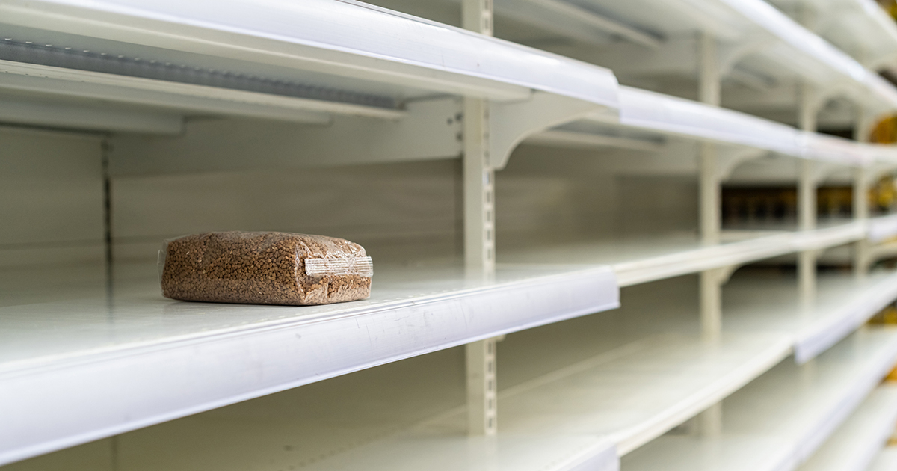
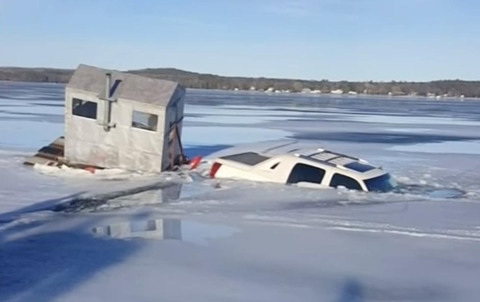

# Emergency Preparedness

Tyler Akins

<table width="30%"><tr><td>

</td></tr></table>

---

## Who am I?

Tyler Akins

612-387-8102  
fidian@rumkin.com

Email is for adults and for Scouts that have a current Cyber Chip.
<!-- .element style="color: red" -->

---

## Expectations

----

<!-- .slide: data-background="on-my-honor-coin.jpg" data-background-size="cover" -->

## Scout-Like Behavior
<!-- .element: style="background-color: rgba(255, 255, 255, 0.6)" -->

----

<!-- .slide: data-background="participation.jpg" data-background-size="contain" -->

## Participation is Expected
<!-- .element: style="background-color: rgba(255, 255, 255, 0.6)" -->

Action verbs matter: Describe - Discuss - Prepare Show - Prepare - Inspect - etc.
<!-- .element: style="background-color: rgba(255, 255, 255, 0.6)" -->

----

## It's Up To You

*You* complete the requirements.

All work needs to be your own.

----

## Not Prepared?

It's okay. Just let me know and we'll move on.

---

### Definition of "Emergency"

What's your best definition?

----

<i>A serious, unexpected, and often dangerous situation requiring immediate action.</i>

- Oxford Languages

----

### Examples of Emergencies

We'll go through a few, categorized by scale.

----

## Global Emergencies

<table><tr><td width="33%">

</td><td width="33%">

</td><td width="50%">

</td></tr><tr><td align="center">

Disease

</td><td align="center">

Climate Change

</td><td align="center">

Aliens

</td></table>

----

## National Emergencies

<table><tr><td width="33%">

</td><td width="33%">

</td><td>

</td></tr><tr><td align="center">

War

</td><td align="center">

Economic Collapse

</td><td align="center">

Supply Chain Failure

</td></tr></table>

----

## Community and Regional Emergencies

<table><tr><td width="33%">

</td><td width="33%">

</td><td>

</td></tr><tr><td align="center">

Flooding

</td><td align="center">

Tornado

</td><td align="center">

Riots

</td></tr></table>

----

How could Scouts help with regional emergencies?

* Flooding
* Tornado
* Riots
* Snowstorm
* Power Outage
* Forced Relocation

----

## Localized Emergencies

<table><tr><td width="33%">

</td><td width="33%">

</td><td>

</td></tr><tr><td align="center">

Fire

</td><td align="center">

Medical Emergency

</td><td align="center">

Accident

</td></table>

----

Scouts can directly help with these!

* House Fire
* Heart Attack
* Getting Lost
* Choking
* Ingestion of Poison
* Automobile Crash
* Falls

---

## First Aid

1: Earn the First Aid merit badge.

----

<!-- .slide: data-background="first-aid-merit-badge.jpg" data-background-size="contain" -->

## On Your Own
<!-- .element style="background-color: rgba(255, 255, 255, 0.6)" -->

It's outside the scope of this merit badge to teach you the necessary lifesaving skills.
<!-- .element style="background-color: rgba(255, 255, 255, 0.6)" -->

---

## Emergency Situations

2(a): Discuss with your counselor the aspects of emergency preparedness and include in your discussion the kinds of questions that are important to ask yourself as you consider each of these:

----

To understand the aspects, we'll use an example of playing outside and getting frostbite.

----

## Prevention

Avoiding the problem is the safest course of action.

Stay warm to prevent frostbite.
<!-- .element style="background-color: #ccf; border: 2px solid black; border-radius: 0.5em;" -->

*What questions would you ask?*

----

## Prevention Questions

* What types of emergencies are possible?
* Which of those are more likely?
* What hazards need to be considered?
* How can we avoid those hazards?

----

## Protection

Protect against the greatest threats and hazards, while allowing our way of life to thrive.

Warm clothes to protect against frostbite.
<!-- .element style="background-color: #ccf; border: 2px solid black; border-radius: 0.5em;" -->

*List questions relating to protection. (Gear, plans, training, etc.)*

----

## Protection Questions

* What plans do we need?
* Have we practiced our plan lately?
* Do we have a disaster kit and is it current?
* Are there warning systems or devices that should be used?
* Is there any training we need?

----

## Mitigation

We will come back to this.

----

## Response

STOP: Stop, Think, Observe, Plan

Administer first aid + focus on your task.

Respond to frostbite by warming the affected area.
<!-- .element style="background-color: #ccf; border: 2px solid black; border-radius: 0.5em;" -->

*What do you need to find out to address the situation?*

----

## Response Questions

* What kinds of medical care should be handled?
* Do you need shelter, and what kind of shelter?
* Is there food and clean water?
* Should people be evacuated?

----

## Recovery

Get back to normal.

Rebuild, repair, heal, console.

Frostbite may need surgery, physical therapy, counseling.
<!-- .element style="background-color: #ccf; border: 2px solid black; border-radius: 0.5em;" -->

*After a trauma, what concerns need to be addressed?*

----

## Recovery Questions

* How do we rebuild?
* Can people be consoled or counseled to return to a normal life?
* What is the process?

----

## Back to Mitigation

Lessen the impact of the next emergency.

Preparing in advance.

Reviewing the signs of frostbite before each winter
<!-- .element style="background-color: #ccf; border: 2px solid black; border-radius: 0.5em;" -->

*Where would you investigate to improve your preparedness?*

----

## Mitigation Questions

* What additional threats can be avoided?
* How can we be more prepared?
* If a problem happens, how can we ensure a more timely response and recovery?
* Can I learn more about how to handle environmental hazards in this area?
* How would I improve the audit checklist for annual reviews?

---

## Planning and Aspects

2(b): Using a chart, spreadsheet, or another method approved by your counselor, demonstrate your understanding of each aspect of emergency preparedness listed in requirement 2(a) (prevention, protection, mitigation, response, and recovery) for 10 emergency situations from the list below. Discuss your findings with your counselor.

----

All work needs to be your own. Use your own words to describe your own ideas.

----

## Why Not Copy And Paste?

"Privilege escalation threat modeling revealed race conditions triggering edge-case memory overflows."

You could copy it, but what does it mean?

----

<table><tr><td width="50%">

* Home stovetop or oven fire
* Home flammable liquid fire
* Gas leak in or near a home or with outside cooking
* Food poisoning
* Automobile crash
* Vehicle stalled in the desert
* Vehicle trapped in a blizzard
* Backcountry injury
* Boating or water accident
* Toxic chemical spills and releases
* Nuclear power plant emergency

</td><td>

* Fire or explosion in a public place
* Violence in a public place
* Wildland fire
* Avalanche (snowslide or rockslide)
* Earthquake
* Tsunami
* Major flooding or a flash flood with water outage
* Hurricane with power outage
* Tornado
* Lightning storm

</td></tr></table>
<!-- .element style="font-size: 0.8em;" -->

----

Demonstrate your understanding of each aspect of emergency preparedness for your chosen situations.

* Prevention - completely stopping the event
* Protection - lessening the chance of harm
* Response - how to best act when it happens
* Recover - getting back to normal
* Mitigation - lessening potential future impact

---

## Planning for Family Emergencies

3(a): At a family meeting, discuss the situations on the chart you created for requirement 2(b) and make emergency plans for sheltering-in-place and for evacuation of your home. Discuss your family meeting and plans with your counselor.

----

3(b): Develop and practice a plan of escape for your family in case of fire in your home. Draw a floor plan with escape routes and a map with a safe meeting place. Discuss your family's home escape plan with your counselor.

----

3(c): Using a checklist in the <em>Emergency Preparedness</em> merit badge pamphlet or one approved by your counselor, prepare or inspect a family disaster kit for sheltering-in-place and for evacuation of your home. Review the needs and uses of the items in a kit with your counselor.

---

## Preventing Accidents and Emergencies

4(a): Using a home safety checklist included in the <em>Emergency Preparedness</em> merit badge pamphlet or one approved by your counselor, inspect a home (or a similar building near where you live or at a camp) for safety hazards with the help of an adult. Present your completed checklist to and discuss your findings with your counselor.

----

The pamphlet does not have a checklist.

Scoutmaster Bucky's workbook does.

US Scouting Project's outdated workbook does.

----

4(b): Develop emergency prevention plans for five family activities outside the home, as approved by your counselor. (Examples are taking a picnic to a park, seeing a movie, attending a worship service, an outing at a beach, traveling to visit a relative, or attending a ball game or concert.) Each plan should include an analysis of possible hazards, proposals to prevent, protect from, mitigate, respond to, and recover from emergencies, and the reasons for the actions that you propose.

----

* Possible Hazards

* Proposals to prevent, protect from, mitigate, respond to, and recover from emergencies

* Reasons for the actions proposed

---

## Dangerous Situations

5: Show how you could save a person from the following dangerous situations without putting yourself in danger:

----

<!-- .slide: data-background="live-household-wire.jpg" data-background-size="contain" -->

5(a): Live household electric wire
<!-- .element style="background-color: rgba(255, 255, 255, 0.5)" -->

Notes:

* Never use a metal or wet object.
* Call 911.
* Start CPR immediately if victim is not breathing.

----

<!-- .slide: data-background="carbon-monoxide.jpg" data-background-size="contain" -->

5(b): A structure   filled with   carbon monoxide
<!-- .element style="background-color: rgba(255, 255, 255, 0.5)" -->

Notes:

Headache, nausea, dizziness, breathlessness, collapse, loss of consciousness

Get outside ASAP. Evacuate everyone from structure. Open windows if unable to leave. Turn off any source of combustion. Call 911. Rescue breathing if necessary.

----

<!-- .slide: data-background="clothes-on-fire.jpg" data-background-size="contain" -->

5(c): Clothes on fire
<!-- .element style="background-color: rgba(255, 255, 255, 0.5)" -->

Notes:

* Stop - stop running.
* Drop - lay down.
* Cover - hide your face.
* Roll - smother the fire.
* Cool immediately for 10-15 minutes

----

<!-- .slide: data-background="drowning.jpg" data-background-size="contain" -->

5(d): Drowning using nonswimming rescues ...
<!-- .element style="background-color: rgba(255, 255, 255, 0.5)" -->

Notes:

* Reach
* Throw
* Row - avoid canoes
* Don't go, unless trained
* Stop rescue if risk is unacceptable

----

<!-- .slide: data-background="drowning-under-ice.jpg" data-background-size="contain" -->

5(d): ... (including accidents on ice)
<!-- .element style="background-color: rgba(255, 255, 255, 0.5)" -->

Notes:

* Reach
* Throw
* Go, carefully, laying on ice, reaching with a stick

---

## Signaling for Help

6(a): Show three ways of attracting and communicating with rescue aircraft or drones.

----

6(b): Show ways to attract attention of searchers on the ground if you are lost in the wilderness.

----

6(c): Show ways to attract attention of searchers on the water if you are stranded with a capsized or disabled motorboat or sailboat.

----

<!-- .slide: data-background="body-signals.gif" data-background-size="contain" -->

----

<!-- .slide: data-background="ground-to-air.jpg" data-background-size="contain" -->

----

<!-- .slide: data-background="air-seeing-signal.jpg" data-background-size="contain" -->

Notes:

Arrow was made from two mylar blankets cut in half. The trunk of the arrow is about 2 feet wide and 14 feet long.

----

<!-- .slide: data-background="grand-canyon-rescue.png" data-background-size="contain" -->

----

<!-- .slide: data-background="grand-canyon-rescue-air.png" data-background-size="contain" -->

----

<!-- .slide: data-background="walkie-talkie.jpg" data-background-size="contain" -->

----

<!-- .slide: data-background="signal-mirror.jpg" data-background-size="contain" -->

----

<!-- .slide: data-background="signal-fire.jpg" data-background-size="contain" -->

Notes:

* 3 large fires in a triangle or in a line, visible, 25 yards between
* Prepare ahead of time and protect them

----

<!-- .slide: data-background="smoke-from-air.jpg" data-background-size="contain" -->

----

<!-- .slide: data-background="smoke-from-air2.jpg" data-background-size="contain" -->

Notes:

* Most natural materials burn with white smoke.
* Man-made synthetic materials burn with black smoke.

----

<!-- .slide: data-background="chemlight.jpg" data-background-size="contain" -->

Notes:

Chemlight on paracord swung around head to make a larger, visible signal.

---

## Moving an Injured Person

7: With another person, show two good ways to transport an injured person out of a remote area using improvised stretchers to conserve the energy of rescuers while ensuring the well-being and protection of the injured person.

----

stretcher: A litter, usually of canvas stretched over a frame, used to transport the sick, wounded, or dead.

litter: A flat supporting framework, such as a piece of canvas stretched between parallel shafts, for carrying a disabled or dead person; a stretcher.

- American Heritage Dictionary

----

<!-- .slide: data-background="improvised-stretcher.png" data-background-size="contain" -->

----

<!-- .slide: data-background="improvised-stretcher.gif" data-background-size="contain" -->

----

<!-- .slide: data-background="travois.jpg" data-background-size="contain" -->

----

For fun, I asked AI to generate a picture showing improvised stretchers.

None are diagrammed correctly.

----

<!-- .slide: data-background="bad-improvised-stretchers.png" data-background-size="contain" -->

---

Even though carries are not stretchers, they are often practiced. You will expend a tremendous amount of energy carrying someone.

When possible, conserve the rescuer's energy!

----

<!-- .slide: data-background="improvised-splint.jpg" data-background-size="contain" -->

----

<!-- .slide: data-background="firemans-carry.svg" data-background-size="contain" -->

Notes:

Fireman's carry

----

<!-- .slide: data-background="supporting-carry.svg" data-background-size="contain" -->

Notes:

Supporting carry

Victim must be able to walk or hop

----

<!-- .slide: data-background="arms-carry.svg" data-background-size="contain" -->

Notes:

Arms carry

Short distance

----

<!-- .slide: data-background="saddleback-carry.svg" data-background-size="contain" -->

Notes:

Saddleback carry

Victim must hold on to the bearer's neck

----

<!-- .slide: data-background="pack-strap-carry.svg" data-background-size="contain" -->

Notes:

Pack-Strap carry

Moderate distance. Hold victim's arms with palms down. Stand as erect as possible after positioning victim.

----

<!-- .slide: data-background="two-person-support-carry.svg" data-background-size="contain" -->

Notes:

Two-person support carry

Can use victim's belt if need to drag unconscious person to safety.

----

<!-- .slide: data-background="two-person-arms-carry.svg" data-background-size="contain" -->

Notes:

Two-person arms carry

Moderate distance. Carry victim high and close to chest. When there's no time for a spine board, this is the safest for transporting a person with a back injury, especially if additional people hold head and legs in alignment.

----

<!-- .slide: data-background="three-person-arms-carry.svg" data-background-size="contain" -->

Notes:

Three-person arms carry

More people makes this easier.

----

<!-- .slide: data-background="two-person-fore-and-aft-carry.svg" data-background-size="contain" -->

Notes:

Two-person fore and aft carry

Long distance. Taller person should be in back.

----

<!-- .slide: data-background="three-person-fore-and-aft-carry.svg" data-background-size="contain" -->

Notes:

Three-person fore and aft carry (Wheelbarrow carry)

Long distance. Requires a wide path and not suitable for one track paths.

----

<!-- .slide: data-background="two-person-four-hand-seat-carry.svg" data-background-size="contain" -->

Notes:

Two-person four-hand seat carry

Conscious victim must hold onto rescuer's shoulders. Moderate distance.

----

<!-- .slide: data-background="two-person-two-hand-seat-carry.svg" data-background-size="contain" -->

Notes:

Short distance.

---

## NIMS and ICS

8(a): Describe the National Incident Management System (NIMS) and the local Incident Command System (ICS).

----

Before we dive in, let's look at Scouting.

----

Scouting is a framework to help create leaders. It also covers policies and procedures.

The patrol method is a tool within that framework to help small groups manage tasks.

Scouting says "how we work with youth." The patrol method defines "how a small group can manage itself."

----

## National Incident Management System (NIMS)

Helps government at all levels work together to prepare for, prevent, respond to, recover from, and mitigate the effects of incidents regardless of the incident's cause, size, location, or complexity.

* Shared processes (playbook)
* Shared vocabulary
* Defined routines during incidents (like ICS)

----

## Incident Command System (ICS)

Provides effective, cross-jurisdictional coordination with a standardized, hierarchical structure.

* Organizational "best practices"
* Works across agencies, both within and outside of government
* Ensures most pressing needs are met and resources are not wasted

----

NIMS is a framework. It also covers policies, procedures, and best practices.

ICS is a tool within that framework, focused solely on the command and control of a specific emergency situation.

NIMS says "how we work together." ICS defines "how we manage this incident."

----

8(b): Find out how your community and its leaders work to manage and to train for disasters. Discuss this information with your counselor.

Like troops, each community is generally the same but have noticeable differences.

----

8(c): Discuss how a Scout troop can help in an emergency situation using ICS.

---

## Emergency Service

9(a): Discuss with your counselor the duties that a Scout troop should be prepared to do, the training they need, and the safety precautions they should take for the following emergency services:

----

1. Crowd and traffic control
2. Messenger service during an incident
3. Collection and distribution services
4. Group feeding, shelter, and sanitation

----

9(b): Prepare a written plan for mobilizing your troop when needed to do emergency service. If your troop already has a mobilization plan, present the plan to your counselor and tell your part in making the plan work.

----

Brief outline for a burning house, mid 1800's:

* Send runners down the street to seek help
* People show up with buckets
* Organizer puts them into a bucket brigade
* Organizer decides what is of most value to save
* Those closest to fire are monitored for their health and safety
* Organizer determines when emergency is over

----

Your plan should be much more detailed.

A new member of your troop should be able to follow the instructions and know what to do.

Is your plan complete enough that you can rehearse it?

----

Mobilization Plan

* Specific roles and responsibilities
* How you inform everyone
* When and where you meet
* How work is determined and distributed
* How to monitor participants
* Additional needs (food, bathroom, water, stress)
* When to end

----

9(c): Using a checklist in the <em>Emergency Preparedness</em> merit badge pamphlet or one approved by your counselor, prepare or inspect a personal emergency service pack for a mobilization call. Explain the needs and uses of the contents to your counselor.

----

9(d): Take part in an emergency service project, either a real one or a practice exercise, with a Scouting troop or a community agency or at Scout camp or at a school. Review what you learned and practiced with your counselor.

---

## Looking Ahead

Do ONE of the following

----

10(a): Interview an emergency services coordinator or a civil servant about their work in disaster management. Learn about how they chose this career and about their duties. Discuss what you learned with your counselor and whether you might be interested in this career.

----

10(b): Identify three career opportunities that would use skills and knowledge in emergency services. Pick one and research the training, education, certification requirements, experience, and expenses associated with entering the field. Research the prospects for employment, starting salary, advancement opportunities, and career goals associated with this career. Discuss what you learned with your counselor and whether you might be interested in this career.

----

10(c): Identify how you might use the skills and knowledge in the field of emergency preparedness to pursue a personal hobby and/or healthy lifestyle. Research the additional training required, expenses, and affiliation with organizations that would help you maximize the enjoyment and benefit you might gain from it. Discuss what you learned with your counselor and share what short-term and long-term goals you might have if you pursued this.

---

# THE END

*You survived!*
<!-- .element style="font-size: 0.6em" -->

----

Tyler Akins

<table><tr><td>

12650 130th Ave N 
Dayton, MN 55327

</td><td>

612-387-8102  
fidian@rumkin.com

</td></tr></table>

Email is for adults and for Scouts that have a current Cyber Chip.
<!-- .element style="color: red" -->
