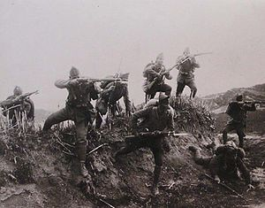

# Emergency Preparedness

Tyler Akins

<table width="30%"><tr><td>

</td></tr></table>

---

## Who am I?

Tyler Akins

Accident prone + lived in obscure area

612-387-8102  
fidian@rumkin.com

Email is for adults and for Scouts that have a current Cyber Chip.
<!-- .element style="color: red" -->

---

## Expectations

----

<!-- .slide: data-background="on-my-honor-coin.jpg" data-background-size="cover" -->

## Scout-Like Behavior
<!-- .element: style="background-color: rgba(255, 255, 255, 0.5)" -->

Respectful and engaged, otherwise you will be asked to leave.
<!-- .element: style="background-color: rgba(255, 255, 255, 0.5)" -->

----

## Like College, Not High School

With college, you pay the instructor to teach. It's up to the student to learn.

----

## Not Prepared?

It's okay. Let me know, I make a note, and we will simply move on.

I'll try to help achieve as many requirements as possible.

----

## Action Verb

Each requirement has action verbs. "Describe," "prepare," "report," "interview," and other actions need to be performed.

Requirements must be met word for word.

----

## Ethics

Scouts are expected to have done their own work. It is immoral to claim another person's work as your own. This includes:

* Making your own kit instead of entirely relying on a pre-made emergency kit.

* Writing your own words for the chart in 2C, not copying and pasting. Or you can explain each section in your own words.

----

## Participation Is Expected

---

### What Is An Emergency?

----

## Localized Emergencies

<table><tr><td width="50%">

</td><td>

</td></tr></table>

Notes:

* House on fire
* CPR
* Active shooter
* Car accident
* Ingestion of poison
* Gas leak
* Explosion

----

## Community and Regional Emergencies

<table><tr><td width="33%">

</td><td width="33%">

</td><td>

</td></tr></table>

Notes:

* Flood
* Tornado
* Riots
* Earthquake

----

## National Emergencies

<table><tr><td width="50%">

</td><td width="50%">

</td></tr></table>

Notes:

* War
* Economic or trade emergencies

----

## Global Emergencies

<table><tr><td width="50%">

</td><td width="50%">

</td></tr></table>

Notes:

* Disease
* Climate change
* Nuclear reactor explosions

---

## First Aid

1: Earn the First Aid merit badge.

----

<!-- .slide: data-background="first-aid-merit-badge.jpg" data-background-size="contain" -->

## On Your Own
<!-- .element style="background-color: rgba(255, 255, 255, 0.5)" -->

It's outside the scope of this merit badge to teach you the necessary lifesaving skills.
<!-- .element style="background-color: rgba(255, 255, 255, 0.5)" -->

---

## Planning and Aspects

2: Do the following:

2a: Discuss with your counselor the aspects of emergency preparedness: prevention, protection, mitigation, response, recovery.

Include in your discussion the kinds of questions that are important to ask yourself as you consider each of these.

----

## Prevention

Avoiding the problem is the safest course of action.

Notes:

Safety First

----

## Protection

Make a plan and practice it.

Make a kit and ensure it's ready.

Warning devices.

Notes:

Smoke detectors are warning devices.

----

## Mitigation

We will come back to this.

----

## Response

STOP: Stop, Think, Observe, Plan

First Aid.

Focus on your task.

Notes:

Avoid chaos and panic. Speak clearly. Ensure people know what's going on and direct them to best help the situation.

----

## Recovery

Get back to normal.

Rebuild, repair, heal, console.

----

## Mitigation

Lessen the impact of the next emergency by taking action now.

It's **taking an action** to see if you can improve any of the other four aspects.

Notes:

Taking this class can be seen as a mitigation step. Checklists, audits, and annual reviews are also mitigation steps.

The important part is that it is an action you are taking.

---

## Planning and Aspects

2: Do the following:

2b: Using a chart, graph, spreadsheet, or another method approved by your counselor, demonstrate your understanding of each aspect of emergency preparedness listed in requirement 2a for 10 emergency situations from the list below. Discuss your findings with your counselor.

----

## Let's be REAL CLEAR

Using a chart, graph, spreadsheet, or another method approved by your counselor, demonstrate your understanding of each aspect of emergency preparedness listed in requirement 2a for 10 emergency situations from the list below. Discuss your findings with your counselor.

----

## Ethics Again

All work needs to be your own. Don't try to claim someone else's worksheet chart as your own.

If you have any of the answers in this presentation, cross them out. You can recreate the chart and finish this merit badge after the class is over.

Alternately, you are able to explain each topic in your own words.

----

## Why Not Copy And Paste?

"Privilege escalation threat modeling revealed race conditions triggering edge-case memory overflows."

You can copy and paste it, but you that doesn't mean you can demonstrate your understanding of the words.

----

You must use these five situations. Discuss prevention, protection, mitigation, response, recovery.

1. Home kitchen fire
2. Home basement / storage room / garage fire
3. Explosion in the home
4. Automobile crash
5. Food-borne disease (food poisoning)

----

Pick 5 more from this list. Discuss prevention, protection, mitigation, response, recovery.

----

6. Fire or explosion in a public place <!-- .element: style="font-size: 0.80em" -->
7. Vehicle stalled in the desert <!-- .element: style="font-size: 0.80em" -->
8. Vehicle trapped in a blizzard <!-- .element: style="font-size: 0.80em" -->
9. Earthquake or tsunami <!-- .element: style="font-size: 0.80em" -->
10. Mountain / backcountry accident <!-- .element: style="font-size: 0.80em" -->
11. Boating or water accident <!-- .element: style="font-size: 0.80em" -->
12. Gas leak in a home or a building <!-- .element: style="font-size: 0.80em" -->
13. Tornado or hurricane <!-- .element: style="font-size: 0.80em" -->
14. Major flooding or a flash flood <!-- .element: style="font-size: 0.80em" -->
15. Toxic chemical spills and releases <!-- .element: style="font-size: 0.80em" -->
16. Nuclear power plant emergency <!-- .element: style="font-size: 0.80em" -->
17. Avalanche (snowslide or rockslide) <!-- .element: style="font-size: 0.80em" -->
18. Violence in a public place <!-- .element: style="font-size: 0.80em" -->

---

## Planning and Aspects

2: Do the following:

2c: Meet with and teach your family how to get or build a kit, make a plan, and be informed for the situations on the chart you created for requirement 2b. Complete a family plan. Then meet with your counselor and report on your family meeting, discuss their responses, and share your family plan.

Notes:

Do not focus on the kit itself at this point. It comes up again later.

---

3: Show how you could safely save a person from the following:

----

<!-- .slide: data-background="live-household-wire.jpg" data-background-size="contain" -->

3a: Touching a live household wire
<!-- .element style="background-color: rgba(255, 255, 255, 0.5)" -->

----

<!-- .slide: data-background="carbon-monoxide.jpg" data-background-size="contain" -->

3b: A structure   filled with   carbon monoxide
<!-- .element style="background-color: rgba(255, 255, 255, 0.5)" -->

----

<!-- .slide: data-background="clothes-on-fire.jpg" data-background-size="contain" -->

3c: Clothes on fire
<!-- .element style="background-color: rgba(255, 255, 255, 0.5)" -->

----

<!-- .slide: data-background="drowning.jpg" data-background-size="contain" -->

3d: Drowning using nonswimming rescues
<!-- .element style="background-color: rgba(255, 255, 255, 0.5)" -->

Notes:

* Reach
* Throw
* Row
* Don't go, unless trained

----

<!-- .slide: data-background="drowning-under-ice.jpg" data-background-size="contain" -->

3d: ... (including accidents on ice)
<!-- .element style="background-color: rgba(255, 255, 255, 0.5)" -->

Notes:

* Reach
* Throw
* Go, carefully, laying on ice, reaching with a stick

---

4: Show three ways of attracting and communicating with rescue planes / aircraft.

----

<!-- .slide: data-background="body-signals.gif" data-background-size="contain" -->

----

<!-- .slide: data-background="ground-to-air.jpg" data-background-size="contain" -->

----

<!-- .slide: data-background="air-seeing-signal.jpg" data-background-size="contain" -->

Notes:

Arrow was made from two mylar blankets cut in half. The trunk of the arrow is about 2 feet wide and 14 feet long.

----

<!-- .slide: data-background="grand-canyon-rescue.png" data-background-size="contain" -->

----

<!-- .slide: data-background="grand-canyon-rescue-air.png" data-background-size="contain" -->

----

<!-- .slide: data-background="walkie-talkie.jpg" data-background-size="contain" -->

----

<!-- .slide: data-background="signal-mirror.jpg" data-background-size="contain" -->

----

<!-- .slide: data-background="signal-fire.jpg" data-background-size="contain" -->

----

<!-- .slide: data-background="smoke-from-air.jpg" data-background-size="contain" -->

----

<!-- .slide: data-background="smoke-from-air2.jpg" data-background-size="contain" -->

---

5: With another person, show a good way to transport an injured person out of a remote and/or rugged area, conserving the energy of rescuers while ensuring the well-being and protection of the injured person.

----

<!-- .slide: data-background="two-person-carry.jpg" data-background-size="contain" -->

----

<!-- .slide: data-background="two-person-carry-2.jpg" data-background-size="contain" -->

----

<!-- .slide: data-background="one-person-carry.jpg" data-background-size="contain" -->

----

<!-- .slide: data-background="improvised-stretcher.png" data-background-size="contain" -->

----

<!-- .slide: data-background="improvised-stretcher.gif" data-background-size="contain" -->

----

<!-- .slide: data-background="improvised-splint.jpg" data-background-size="contain" -->

---

6: Do the following:

6a: Describe the National Incident Management System (NIMS) and the Incident Command System (ICS).

----

## National Incident Management System (NIMS)

Helps government at all levels work together to prepare for, prevent, respond to, recover from, and mitigate the effects of incidents regardless of the incident's cause, size, location, or complexity.

----

## Incident Command System (ICS)

Provides effective, cross-jurisdictional coordination.

Represents organizational "best practices" and is the standard for emergency management across the country.

----

6b: Identify the government or community agencies that normally handle and prepare for emergency services similar to those of the NIMS or ICS.

Notes:

* Hennepin County, and each city's Emergency Operation Plan.
* National Weather Service Twin Cities.
* Federal Emergency Management Agency.

----

6b: (continued) Explain to your counselor one of the following:

1. How the NIMS/ICS can assist a Scout troop when responding in a disaster.
2. How a group of Scouts could volunteer to help in an event of these types of emergencies.

----

6c: Find out who is your community's emergency management director and learn what this person does to prevent, protect, mitigate, respond to, and recover from emergency situations in your community. Discuss this information with your counselor, utilizing the information you learned from requirement 2b.

---

7: Do the following:

7a: Take part in an emergency service project, either a real one or a practice drill, with a Scouting unit or a community agency.

----

7b: Prepare a written plan for mobilizing your troop when needed to do emergency service. If there is already a plan, explain it. Tell your part in making it work.

---

8: Do the following:

8a: Tell the things a group of Scouts should be prepared to do, the training they need, and the safety precautions they should take for the following emergency services:

1. Crowd and traffic control.
2. Messenger service and communications.
3. Collection and distribution services.
4. Group feeding, shelter, and sanitation.

----

8b: Prepare a personal emergency service pack for a mobilization call. Prepare a family emergency kit (suitcase or waterproof box) for use by your family in case an emergency evacuation is needed. Explain the needs and uses of the contents.

----

<!-- .slide: data-background="kit.jpg" data-background-size="contain" -->

## My Kit
<!-- .element style="background-color: rgba(255, 255, 255, 0.5)" -->

Notes:

I'll go over the major groupings of items in my pack.

----

<!-- .slide: data-background="kit-first-aid-and-medicines.jpg" data-background-size="contain" -->

## First Aid and Medicines
<!-- .element style="background-color: rgba(255, 255, 255, 0.5)" -->

----

<!-- .slide: data-background="kit-shelter-and-protection.jpg" data-background-size="contain" -->

## Shelter and Protection
<!-- .element style="background-color: rgba(255, 255, 255, 0.5)" -->

Notes:

Heavy duty garbage bag as a raincoat or shelter.

----

<!-- .slide: data-background="kit-water-and-food.jpg" data-background-size="contain" -->

## Water and Food
<!-- .element style="background-color: rgba(255, 255, 255, 0.5)" -->

Food is much less important.
<!-- .element style="background-color: rgba(255, 255, 255, 0.5)" -->

Notes:

Purification tablets plus a water filter. Two separate systems that will work.

----

<!-- .slide: data-background="kit-fire.jpg" data-background-size="contain" -->

## Fire
<!-- .element style="background-color: rgba(255, 255, 255, 0.5)" -->

Notes:

Three different ways to start fires, plus emergency tinder. Most are waterproof.

* Lighter + cotton balls rubbed in Vasoline
* Flint + magnesium bar (magnesium is tinder)
* Flint wheel + Tinder Quick

----

<!-- .slide: data-background="kit-cooking.jpg" data-background-size="contain" -->

## Cooking
<!-- .element style="background-color: rgba(255, 255, 255, 0.5)" -->

----

<!-- .slide: data-background="kit-tools.jpg" data-background-size="contain" -->

## Tools
<!-- .element style="background-color: rgba(255, 255, 255, 0.5)" -->

----

<!-- .slide: data-background="kit-hygiene.jpg" data-background-size="contain" -->

## Hygiene
<!-- .element style="background-color: rgba(255, 255, 255, 0.5)" -->

----

<!-- .slide: data-background="kit-communication.jpg" data-background-size="contain" -->

## Communication and Lighting
<!-- .element style="background-color: rgba(255, 255, 255, 0.5)" -->

----

<!-- .slide: data-background="kit-assembled.jpg" data-background-size="contain" -->

## My Kit
<!-- .element style="background-color: rgba(255, 255, 255, 0.5)" -->

---

9: Do one of the following:

9a: Using a safety checklist approved by your counselor, inspect your home for potential hazards. Explain the hazards you find and how they can be corrected.

----

Or

9b: Review or develop a plan of escape for your family in case of fire in your home.

----

Or

9c: Develop an accident prevention program for five family activities outside the home (such as taking a picnic or seeing a movie) that includes an analysis of possible hazards, a proposed plan to correct those hazards, and the reasons for the corrections you propose.

---

# THE END

### Thank you!

*You survived!*
<!-- .element style="font-size: 0.6em" -->

----

Tyler Akins

<table><tr><td>

12650 130th Ave N 
Dayton, MN 55327

</td><td>

612-387-8102  
fidian@rumkin.com

</td></tr></table>

Email is for adults and for Scouts that have a current Cyber Chip.
<!-- .element style="color: red" -->
