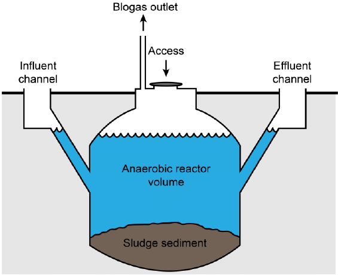
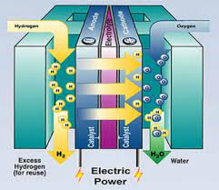
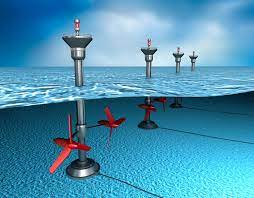

# Energy

Tyler Akins

<table width="30%"><tr><td>

</td></tr></table>

----

## Who am I?

Tyler Akins

Fascinated by science 
Nova award counselor, Supernova award mentor

612-387-8102  
fidian@rumkin.com

</td></tr></table>

Email is for adults and for Scouts that have a current Cyber Chip.
<!-- .element style="color: red" -->

---

## Expectations

----

<!-- .slide: data-background="on-my-honor-coin.jpg" data-background-size="cover" -->

## Scout-Like Behavior
<!-- .element: style="background-color: rgba(255, 255, 255, 0.5)" -->

Respectful and engaged, otherwise you will be asked to leave.
<!-- .element: style="background-color: rgba(255, 255, 255, 0.5)" -->

----

## My Purpose

I am here to provide information and *help* you complete the requirements.

`-` HOWEVER `-`

You must be the one that completes the work.

----

## Not Prepared?

It's okay. Let me know, I make a note, and we will simply move on.

I'll try to help achieve as many requirements as possible.

----

## Action Verb

Each requirement has action verbs. "Describe," "prepare," "report," "interview," and other actions need to be performed.

Requirements must be met word for word.

----

## Participation Is Expected

Notes:

This also means you should follow along and know what question we are discussing.

---

## What is "Energy?"

----

### Definitions

**energy**: power derived from the utilization of physical or chemical resources, especially to provide light and heat or to work machines.

**energy**: the property of matter and radiation which is manifest as a capacity to perform work (such as causing motion or the interaction of molecules).

----

### Examples of Energy

What examples can you provide?

<table><tr><td width="50%">

Atomic / Nuclear

Chemical / Food

Electrical

</td><td width="50%">

Mechanical / Kinetic / Gravitational / Sound

Radiant / Light / Radio

Thermal / Heat

</td></tr>

----

Batteries - chemical energy converted to electricity

Solar panels - light (photons) transmitting through space and air to solar panels (radiant) and converted to electricity

Fire - chemical reaction that produces heat and light

Dropping a book - Gravitational energy causes the book to move down and landing will cause a shockwave plus generate sound

----

<!-- .slide: data-background="forms-of-energy.png" data-background-size="contain" -->

---

## Requirement 1a

With your parent’s permission, use the internet to find a blog, podcast, website, or an article on the use or conservation of energy. Discuss with your counselor what details in the article were interesting to you, the questions it raises, and what ideas it addresses that you do not understand.

---

## Requirement 2a

Explain how THREE of the following devices use energy, and explain their energy conversions: toaster, greenhouse, lightbulb, bow drill, cell phone, nuclear reactor, sweat lodge.

----

<!-- .slide: data-background="toaster.jpg" data-background-size="contain" -->

1. Lever is pressed -> potential energy in spring
2. Electricity flows -> heat and light
3. Spring is released -> kinetic energy

----

<!-- .slide: data-background="greenhouse.jpg" data-background-size="contain" -->

1. Sun shines -> heat (infrared light)
2. Sun shines -> photosynthesis (chemical)

----

<!-- .slide: data-background="lightbulb.jpg" data-background-size="contain" -->

Electricity -> heat and light

----

<!-- .slide: data-background="led.jpg" data-background-size="contain" -->

Electricity moving to lower orbit -> heat and light

----

<!-- .slide: data-background="fluorescent.png" data-background-size="contain" -->

Electiricty moving to higher and lower orbits -> heat and light

----

<!-- .slide: data-background="light-vs-heat.jpg" data-background-size="contain" -->

----

<!-- .slide: data-background="bow-drill.svg" data-background-size="contain" -->

1. You use chemical energy -> kinetic energy
2. Spindle rotates under pressure -> heat energy
3. Heat builds to an ember -> chemical reaction of fire

----

<!-- .slide: data-background="cell-phone.png" data-background-size="contain" -->

1. Chemical energy -> electricity
2. Electricity -> radiant (radio transmission)
3. Electricity -> kinetic (sound, vibrate)
4. Electricity -> radiant (light)

----

<!-- .slide: data-background="nuclear-reactor.png" data-background-size="contain" -->

1. Nuclear fission -> heat
2. Heat boils water -> chemical
3. Generated gas turns turbine -> kinetic
4. Turbine spins -> electricity

----

<!-- .slide: data-background="sweat-lodge.jpg" data-background-size="contain" -->

1. Fire (chemical reaction) -> heat and light
2. Heat boils water -> chemical

---

## Requirement 2b

Construct a system that makes at least two energy conversions and explain this to your counselor.

---

## Requirement 3

Show you understand energy efficiency by explaining to your counselor a common example of a situation where energy moves through a system to produce a useful result.

----

a. Identify the parts of the system that are affected by the energy movement.

b. Name the system’s primary source of energy.

c. Identify the useful outcomes of the system.

d. Identify the energy losses of the system.

----

<!-- .slide: data-background="water-cycle.png" data-background-size="contain" -->

Parts + energy source + useful outcomes + losses

----

<!-- .slide: data-background="photosynthesis.png" data-background-size="contain" -->

Parts, 
source, 
outcomes, 
losses

---

## Requirement 4

Conduct an energy audit of your home. Keep a 14-day log that records what you and your family did to reduce energy use. Include the following in your report and, after the 14-day period, discuss what you have learned with your counselor.

----

a. List the types of energy used in your home such as electricity, wood, oil, liquid petroleum, and natural gas, and tell how each is delivered and measured, and the current cost; OR record the transportation fuel used, miles driven, miles per gallon, and trips using your family car or another vehicle.

----

b. Describe ways you and your family can use energy resources more wisely. In preparing your discussion, consider the energy required for the things you do and use on a daily basis (cooking, showering, using lights, driving, watching TV, using the computer). Explain what is meant by sustainable energy sources. Explain how you can change your energy use through reuse and recycling.

---

## Requirement 5

In a notebook, identify and describe five examples of energy waste in your school or community. Suggest in each case possible ways to reduce this waste. Describe the idea of trade-offs in energy use. In your response, do the following:

----

a. Explain how the changes you suggest would lower costs, reduce pollution, or otherwise improve your community.

----

b. Explain what changes to routines, habits, or convenience are necessary to reduce energy waste. Tell why people might resist the changes you suggest.

----

* Identify an example of wasted energy
* Suggest possible ways to reduce the waste
* Explain how this would lower costs, reduce pollution, or other improvements
* What changes need to happen to implement the change
* Why would people be resistant to this change

---

## Requirement 6

Prepare pie charts showing the following information, and explain to your counselor the important ideas each chart reveals. Tell where you got your information. Explain how cost affects the use of a nonrenewable energy resource and makes alternatives practical.

----

a. The energy resources that supply the United States with most of its energy

d. The fuels used to generate America’s electricity

----

<!-- .slide: data-background="us-energy.png" data-background-size="contain" -->

----

b. The share of energy resources used by the United States that comes from other countries

----

<!-- .slide: data-background="us-energy-resources.jpg" data-background-size="contain" -->

----

c. The proportion of energy resources used by homes, businesses, industry, and transportation

----

<!-- .slide: data-background="us-energy-by-sector.jpg" data-background-size="contain" -->

----

e. The world’s known and estimated primary energy resource reserves

----

<!-- .slide: data-background="global-energy-resources.jpg" data-background-size="contain" -->

---

## Requirement 7

Tell what is being done to make FIVE of the following energy systems produce more usable energy. In your explanation, describe the technology, cost, environmental impacts, and safety concerns.

----

### Biomass digesters or waste-to-energy plants

Waste decomposes and slowly produces methane. Low cost, low impact. Maintenance is difficult because the gas is lethal.

----

### Cogeneration plants

Generate both usable heat and electricity; typically burns natural gas. Moderate cost, and larger facilities are more efficient. Releases greenhouse gases by burning fossil fuels, but getting more out of them by producing two usable outputs. Risk of explosions, fire, electrocution.

----

### Fossil fuel power plants

Generates electricity; typically burns coal. Moderate cost, and larger facilities are more efficient. Releases greenhouse gases by burning fossil fuels. Risk of fire, electrocution.

----

### Fuel cells

Turns hydrogen atoms into water by combining them with oxygen. Captures the electric charge that's created when the atoms are combined. Fairly high cost due to the materials involved. Much lower environmental impact. Hydrogen can explode.

----

### Geothermal power plants

Uses the heat of the planet to produce steam, which rotates a turbine to generate electricity. Initial cost is moderate to high, but it's inexpensive to run. When not managed correctly, ground temperatures can be lowered or polluted water can be pushed into the system. Steam pressure can violently rupture, potential for electrocution and it's worsened by the presence of water.

----

### Nuclear power plants

Heat from splitting atoms is used to boil water and turn a turbine to create electricity. Initial cost is extremely high, though operational cost is low. The waste products are small, but stay radioactive for very long time and need to be stored carefully. Lots of potential danger from radiation and the splitting of atoms, though the technology is safer than coal, petroleum, or natural gas.

----

### Solar power systems

Photons excite atoms in layers of silicon, producing an electrical charge. Cost is moderate and falling rapidly. Production of solar cells can produce toxins and uses a lot of energy, though new technology is reducing the environmental impact. Risk of electrocution.

----

### Tidal energy, wave energy, or ocean thermal energy conversion devices

The motion of the waves turn turbines to generate electricity. Cost is moderate due to the difficulty of construction at sea. Environmental impact is being researched, mostly seems to affect marine life. Risk of electrocution made a bit worse by the presence of water.

----

### Wind turbines

Wind pushes turbines to generate electricity. Cost is moderate. Blades have a very limited lifespan and can't be reused, plus birds can be killed when flying too close to the blades. Risk of electrocution.

---

## Requirement 8

Find out what opportunities are available for a career in energy. Choose one position that interests you and describe the education and training required.

---

### Requirement 1b

After you have completed requirements 2 through 8, revisit your source for requirement 1a. Explain to your counselor what you have learned in completing the requirements that helps you better understand the article.

---

# THE END

### Thank you!

*You survived!* <!-- .element style="font-size: 0.6em" -->

----

Tyler Akins

<table><tr><td>

12650 130th Ave N 
Dayton, MN 55327

</td><td>

612-387-8102  
fidian@rumkin.com

</td></tr></table>

Email is for adults and for Scouts that have a current Cyber Chip. <!-- .element style="color: red" -->
