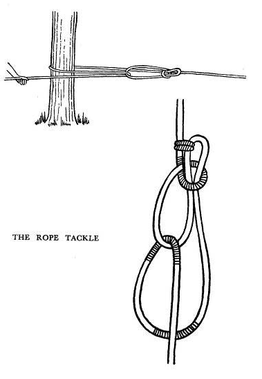
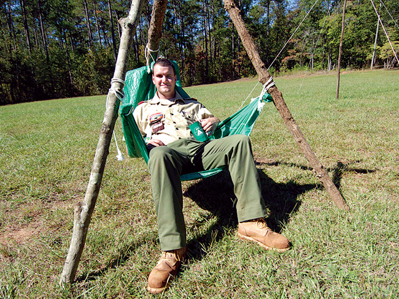

# Pioneering Merit Badge

Tyler Akins

<table width="30%"><tr><td>

</td></tr></table>

Notes:

Bring pioneering kit!

---

## Who am I?

Tyler Akins

Knots at early age (lived in woods + tree care) 
International Guild of Knot Tyers

612-387-8102  
fidian@rumkin.com

Email is for adults and for Scouts that have a current Cyber Chip.
<!-- .element style="color: red" -->

---

## Safety (Part 1)

1a: Explain to your counselor the most likely hazards you might encounter while participating in pioneering activities and what you should do to anticipate, help prevent, mitigate, and respond to these hazards.

----

## Safety (Part 2)

1b: Discuss the prevention of, and first aid treatment for, injuries and conditions that could occur while working on pioneering projects, including rope splinters, rope burns, cuts, scratches, insect bites and stings, hypothermia, dehydration, heat exhaustion, heatstroke, sunburn, and falls.

---

## Fundamentals (Part 1)

2a: Demonstrate the basic and West Country methods of whipping a rope. Fuse the ends of a rope.

----

<!-- .slide: data-background="common-whipping.gif" data-background-size="contain" -->

----

<!-- .slide: data-background="west-country-whipping.png" data-background-size="contain" -->

----

<!-- .slide: data-background="fuse-rope.jpg" data-background-size="contain" -->

----

## Fundamentals (Part 2)

2b: Demonstrate how to tie the following knots: clove hitch, butterfly knot, roundturn with two half hitches, rolling hitch, water knot, carrick bend, sheepshank, and sheet bend.

----

<!-- .slide: data-background="clove-hitch.jpg" data-background-size="contain" -->

----

<!-- .slide: data-background="butterfly-knot.jpg" data-background-size="contain" -->

----

<!-- .slide: data-background="butterfly-knot2.png" data-background-size="contain" -->

----

<!-- .slide: data-background="round-turn-and-two-half-hitches.jpg" data-background-size="contain" -->

----

<table><tr><td>

Attaching to a pole or rod

</td></tr></table>
<table><tr><td>

Attaching to another rope

</td></tr></table>

----

<!-- .slide: data-background="water-knot.jpg" data-background-size="contain" -->

----

<!-- .slide: data-background="carrick-bend.jpg" data-background-size="contain" -->

----

<!-- .slide: data-background="sheepshank.jpg" data-background-size="contain" -->

----

<!-- .slide: data-background="sheet-bend.jpg" data-background-size="contain" -->

----

## Fundamentals (Part 3)

2c: Demonstrate and explain when to use the following lashings: square, diagonal, round, shear, tripod, and floor lashing.

----

<!-- .slide: data-background="square-lashing.jpg" data-background-size="contain" -->

----

<!-- .slide: data-background="diagonal-lashing.jpg" data-background-size="contain" -->

----

<!-- .slide: data-background="round-lashing.jpg" data-background-size="contain" -->

----

<!-- .slide: data-background="shear-lashing.jpg" data-background-size="contain" -->

----

<!-- .slide: data-background="tripod-lashing.jpg" data-background-size="contain" -->

----

<!-- .slide: data-background="floor-lashing.jpg" data-background-size="contain" -->

---

## Throwing Rope

3: Explain why it is useful to be able to throw a rope, then demonstrate how to coil and throw a 40-foot length of 1/4- or 3/8-inch rope. Explain how to improve your throwing distance by adding weight to the end of your rope.

----

<!-- .slide: data-background="coil-rope.jpg" data-background-size="contain" -->

---

## Rope Types

4: Explain the differences between synthetic ropes and natural-fiber ropes. Discuss which types of rope are suitable for pioneering work and why. Include the following in your discussion: breaking strength, safe working loads, and the care and storage of rope.

----

<!-- .slide: data-background="types-of-rope.jpg" data-background-size="contain" -->

Notes:

Nylon stretches. Sisal gets kinks when wet, making it unsuitable. Natural fibers swell and shrink when wet and may need to be stretched before use. Synthetics slip and different knots might need to be used. Polypropylene loses strength when exposed to the sun. Polyethylene develops permanent kinks, making it unsuitable. Cotton is weaker than most others.

----

<!-- .slide: data-background="rope-comparison.png" data-background-size="contain" -->

---

## Splices

5: Explain the uses for the back splice, eye splice, and short splice. Using 1/4- or 3/8-inch three-stranded rope, demonstrate how to form each splice.

----

<!-- .slide: data-background="back-splice.jpg" data-background-size="contain" -->

----

<!-- .slide: data-background="eye-splice.jpg" data-background-size="contain" -->

----

<!-- .slide: data-background="short-splice.jpg" data-background-size="contain" -->

---

## Making Rope

6: Using a rope-making device or machine, make a rope at least 6 feet long consisting of three strands, each having three yarns. Whip the ends.

----

<!-- .slide: data-background="construction-of-rope.gif" data-background-size="contain" -->

Notes:

Fibers or yarn

Strands or cordage

Rope

----

<table><tr><td>

</td><td>

</td></tr></table>

----

<table><tr><td>

</td><td>

</td></tr></table>

----

<!-- .slide: data-background="rope-spinner.jpg" data-background-size="contain" -->

----

<!-- .slide: data-background="make-rope.jpg" data-background-size="contain" -->

Notes:

Traveler on far side because rope will shorten the cordage to about 70% of starting length. Traveler can twist manually or have a swivel.

Spacer is replaced later with a "top".

---

## Anchoring

7: Explain the importance of effectively anchoring a pioneering project. Describe to your counselor the 1-1-1 anchoring system and the log-and-stake anchoring methods.

----

<!-- .slide: data-background="1-1-1-anchoring.jpg" data-background-size="contain" -->

----

<!-- .slide: data-background="log-and-stake-anchoring.jpg" data-background-size="contain" -->

---

## Rope Tackle

8: With the approval of your counselor, demonstrate and use a rope tackle. Be sure the rope tackle is secured properly. Explain the advantages and limitations of using a rope tackle. Describe the potential damage that friction can do to a rope.

----

<table><tr><td>

</td><td>

</td></tr></table>

---

## Trestle

9: By yourself, build a trestle using square and diagonal lashings. Explain why trestles are used when constructing pioneering projects.

----

<!-- .slide: data-background="trestle.jpg" data-background-size="contain" -->

---

## Project

10: With the approval of your counselor and using appropriate lashings and pioneering techniques, build and use one full-size pioneering project from either group A or group B. Your project must comply with the requirements of the Guide to Safe Scouting. (Requirement 10 may be done at summer camp, at district or council events, or on a troop camp outing.)

----

## Project (Teams)

Group A: Tower OR bridge

Anchor your project as appropriate and necessary. Explain how your anchoring system works.

Group A projects may be worked on in a group and with others.

----

<!-- .slide: data-background="rope-bridge.jpg" data-background-size="contain" -->

----

<!-- .slide: data-background="wooden-bridge.jpg" data-background-size="contain" -->

----

<table><tr><td>

</td><td>

</td></tr></table>

----

## Project (Individuals)

Group B: Camp chair OR camp table

Group B projects must be worked on individually.

----

<table><tr><td>

</td><td>

</td></tr></table>

----

<table><tr><td>

</td><td>

</td></tr></table>

---

# THE END

### Thank you!

*You survived!* <!-- .element style="font-size: 0.6em" -->

----

Tyler Akins

<table><tr><td>

12650 130th Ave N 
Dayton, MN 55327

</td><td>

612-387-8102  
fidian@rumkin.com

</td></tr></table>

Email is for adults and for Scouts that have a current Cyber Chip. <!-- .element style="color: red" -->
