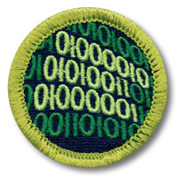

# Programming Merit Badge

Tyler Akins



Notes:

BRING THE HANDOUT

Could bring glare and anti-glare screens.

Ergonomic and differently sized keyboards for examples.

---

## Who am I?

Tyler Akins

Professionally programming since 1995

<table><tr><td>

12650 130th Ave N<br>
Dayton, MN 55327

</td><td>

612-387-8102 <br>
fidian@rumkin.com

</td></tr></table>

Email is for adults and for Scouts that have a current Cyber Chip.
<!-- .element style="color: red" -->

---

## Safety

1a: Show your counselor your current, up-to-date Cyber Chip.

1b: Discuss first aid prevention for potential injuries, such as eyestrain and repetitive stress injuries, that could occur during programming activities.

----

### Cyber Chip

There is a section at the end of the presentation that should help you get started with this requirement.

It is beyond the scope of this class. You must do some work with your Scoutmaster and parents or guardians.

----

### Potential Injuries

Can you think of anything harmful for your body during programming?

What about harm to others?

----

### Eye Strain

* "Fatigue of the eyes"
* Take breaks
* Work in a well-lit room
* Minimize glare
* Blink more
* Exercise eyes
* Look at distant objects

Notes:

Show difference between glare and anti-glare monitors.

----

### Repetitive Stress Injuries

* "Too much stress on a part of the body, resulting in inflammation, muscle strain, tissue damage"
* Carpal tunnel syndrome is one example
* Use good posture when sitting
* Loosen shoulders and use a light touch on your keyboard
* Clair and desk should allow 90° angles at knees, hips, elbows
* Take frequent breaks

Notes:

Show keyboard size differences and what an ergonomic keyboard can look like.

----


----

# Other Injuries

* Electrical shock when working directly on circuits
* Cuts from sharp edges within computers
* Headaches from flickering lights, especially fluorescent bulbs
* Job stress

----

### Programmed Devices Can Malfunction

Medical devices have been known to crash, endangering a patient's life.

Self-driving cars can still get into accidents.

Power grids have been hacked. If done during a heat wave, people could die.

Cell phones can start on fire.

Notes:

This only covers physical injuries. What about stolen information, leaked pictures, hacked webcams?

---

## History

2a: Give a brief history of programming, including at least three milestones related to the advancement or development of programming.

Notes:

Bucky needs Scouts to come prepared, hopefully with notes.

----

<table><tr><td width="50%">

### Ada Lovelace

First published program was written by Augusta Ada King, Countess of Lovelace (née Byron) in 1843. She wrote it for the idea of the "analytical engine," a mechanical computer, from Charles Babbage.

The analytical engine was never created.

</td><td>


</td></tr></table>

----

<table><tr><td width="60%">

### Konrad Zuse

Tired of using a mechanical adding machine, Konrad built the first general-purpose computer in 1941 after 6 years of work. The computer was programmed with a variant of binary. He also designed the first high level programming language, Plankalkül.

</td><td>


</td></tr></table>

Notes:

This is a Zuze Z1 replica in the German Museum of Technology in Berlin.

----

<table><tr><td width="60%">

### ENIAC

The Electronic Numerical Integrator And Calculator was created by J. Presper Eckert and John W. Mauchly in 1945. A lightning strike destroyed it a decade later.

It is estimated ENIAC ran more calculations than all humankind did up to that point.

</td><td>


</td></tr></table>

Notes:

The computer didn't fit into the picture.

----

### Simula

This was the first object-oriented programming language. It was designed in 1962 for performing simulations.

----

### ML

This programming language had the first polymorphic type system.

Before:

```
response.sendString("string");
response.sendNumber(12345);
```

After:

```
response.send("string");
response.send(12345);
```

---

## History

2b: Discuss with your counselor the history of programming and the evolution of programming languages.

Notes:

The goal is to always make difficult things easier.

----

<!-- .slide: data-background="punch-cards.png" theme="black" -->

### In The Beginning
<!-- .element style="background-color: rgba(255, 255, 255, 0.5)" -->

Notes:

See how about half of the card was used? This was so the programmers could add additional instructions to fix cards.

----

<table><tr><td>

### Example: FizzBuzz

* Count from 1 to 100
* If a multiple of 3, print "Fizz"
* If a multiple of 5, print "Buzz"
* If a multiple of both 3 and 5, print "FizzBuzz"
* Otherwise print the number

This is used when learning languages and during interviews.

</td><td width="30%">

```
1
2
Fizz
4
Buzz
Fizz
7
8
Fizz
Buzz
11
Fizz
13
14
FizzBuzz
16
17
```

</td></tr></table>

----

### Assembly (1950's)

*So much simpler than punched cards!*

<table style="width: 100%; font-size: 0.5em"><tr><td>

```
FIZZBUZZ CSECT
         USING *,12
         STM   14,12,12(13)
         LR    12,15
         LA    15,SAVE
         ST    15,8(13)
         ST    13,4(15)
         LR    13,15
         LA    10,LOOP
         LA    8,100
         LA    5,=F'1'
LOOP     EQU   *
         A     5,=F'1'
         AP    NUM,=PL1'1'
         B     CHK15
LCHK15   EQU   *
         B     CHK3
LCHK3    EQU   *
         B     CHK5
LCHK5    EQU   *
         MVC   EOUT,EMSK
         EDMK  EOUT,NUM
ENLOOP   EQU   *
         WTO   MF=(E,WTOSTART)
         BCTR  8,10
```

</td><td>

```
         L     13,4(13)
         LM    14,12,12(13)
         XR    15,15
         BR    14
CHK3     EQU   *
         LR    6,5
         A     6,=F'1'
         SRDA  6,32
         D     6,=F'3'
         C     6,=F'0'
         BE    DIV3
         B     LCHK3
CHK15    EQU   *
         LR    6,5
         A     6,=F'1'
         SRDA  6,32
         D     6,=F'15'
         C     6,=F'0'
         BE    DIV15
         B     LCHK15
CHK5     EQU   *
         LR    6,5
         A     6,=F'1'
         SRDA  6,32
```

</td><td>

```
         D     6,=F'5'
         C     6,=F'0'
         BE    DIV5
         B     LCHK5
DIV3     EQU   *
         MVC   EOUT,FIZZ
         B     ENLOOP
DIV5     EQU   *
         MVC   EOUT,BUZZ
         B     ENLOOP
DIV15    EQU   *
         MVC   EOUT,FIZZBUZ
         B     ENLOOP
FIZZBUZ  DC    CL10'FIZZBUZZ!'
FIZZ     DC    CL10'FIZZ!'
BUZZ     DC    CL10'BUZZ!'
NUM      DC    PL3'0'
TEMP     DS    D
EMSK     DC    X'402020202020'
WTOSTART DC    Y(WTOEND-*,0)
EOUT     DS    CL10
WTOEND   EQU   *
SAVE     DS    18F
         END   HELLO
```

</td></tr></table>

----

### BASIC (1964)

Made to teach kids

```
FOR A = 1 TO 100
   OUT$ = ""

   IF A MOD 3 = 0 THEN
      OUT$ = "Fizz"
   END IF

   IF A MOD 5 = 0 THEN
      OUT$ = OUT$ + "Buzz"
   END IF

   IF OUT$ = "" THEN
      OUT$ = STR$(A)
   END IF

   PRINT OUT$
NEXT A
```

----

### Pascal (1970)

Designed to encourage good programming

```
program fizzbuzz(output);
var
  i: integer;
begin
  for i := 1 to 100 do
    if i mod 15 = 0 then
      writeln('FizzBuzz')
    else if i mod 3 = 0 then
      writeln('Fizz')
    else if i mod 5 = 0 then
      writeln('Buzz')
    else
      writeln(i)
end.
```

----

### C (1972)

Lover level, system programs

```
#include<stdio.h>

int main (void)
{
    int i;
    for (i = 1; i <= 100; i++)
    {
        if (!(i % 15))
            printf ("FizzBuzz");
        else if (!(i % 3))
            printf ("Fizz");
        else if (!(i % 5))
            printf ("Buzz");
        else
            printf ("%d", i);

        printf("\n");
    }
    return 0;
}
```

----

### Perl (1987)

Made to create reports and process text

```
use strict;
use warnings;
use feature qw(say);

for my $i (1..100) {
    say $i % 15 == 0 ? "FizzBuzz"
      : $i %  3 == 0 ? "Fizz"
      : $i %  5 == 0 ? "Buzz"
      : $i;
}
```

----

### Python (1991)

Emphasizes readable code

```
for i in xrange(1, 101):
    if i % 15 == 0:
        print "FizzBuzz"
    elif i % 3 == 0:
        print "Fizz"
    elif i % 5 == 0:
        print "Buzz"
    else:
        print i
```

----

### Java (1995)

Write once, run anywhere

```
public class FizzBuzz{
	public static void main(String[] args){
		for(int i= 1; i <= 100; i++){
			if(i % 15 == 0){
				System.out.println("FizzBuzz");
			}else if(i % 3 == 0){
				System.out.println("Fizz");
			}else if(i % 5 == 0){
				System.out.println("Buzz");
			}else{
				System.out.println(i);
			}
		}
	}
}
```

----

### JavaScript (1995)

Unrelated to Java, honest

```
var fizzBuzz = function () {
  var i, output;
  for (i = 1; i < 101; i += 1) {
    output = '';
    if (!(i % 3)) {
      output += 'Fizz';
    }
    if (!(i % 5)) {
      output += 'Buzz';
    }
    console.log(output || i);
  }
};
```

---

## General Knowledge

3a: Create a list of 10 popular programming languages in use today and describe which industry or industries they are primarily used in and why.

3b: Describe three different programmed devices you rely on every day.

Notes:

Bucky requires effort to have been put into this section for sign off.

----

### Most Popular Languages of 2019

This is an unsorted list <!-- .element style="font-size: 0.6em" -->

<div style="font-size:0.6em">

| Name        | Where        | How Used                                   |
|-------------|--------------|--------------------------------------------|
| SQL         | Everywhere   | Find information in databases              |
| Java        | Big Business | Common coding platform + Android           |
| Python      | Several      | Scripting language, simple effective       |
| JavaScript  | Web Pages    | Provides interaction with users            |
| C           | Everywhere   | System level programming                   |
| C++         | Everywhere   | Larger programs, still mostly system level |
| C#          | Microsoft    | Desktops, tablets, phones                  |
| Perl, Shell | Unix         | Quick data manipulation programs           |
| Swift       | Apple        | Desktops, tablets, phones                  |
| PHP         | Web Servers  | Fill web pages with dynamic info           |

</div>

Notes:

Don't need to write this down. Great time to introduce the handout.

----

### What devices are programmed?

How many can you name?

----

<!-- .slide: data-background="programmed-devices.png" theme="black" -->

### Programmed Devices

---

## Intellectual Property

4a: Explain the four types of intellectual property used to protect computer programs.

4b: Describe the difference between licensing and owning software.

4c: Describe the differences between freeware, open source, and commercial software, and why it is important to respect the terms of use of each.

Notes:

Bucky recommends notes and requires active participation in class discussion as well as being able to satisfy the counselor of their understanding of each.

----

### Intellectual Property Protection

**Copyright** - Exclusive legal right granted to the originator to print, publish, perform, film, record material and to authorize others

**Patents** - Exclude others from making, using, selling an invention

**Trademarks** - Symbol or words registered to represent a company or product

**Trade Secrets** - Secret device or technique used by a company

Notes:

Copyright applies to basically any written or printed work, like books.

Patents apply to processes, like new ways to create medicines.

Trademarks are for symbols.

Trade secrets are not really protected by law, like the secret recipe for Coca-Cola.

----

### Licensing - vs - Ownership

<table><tr><td width="50%">

Legal contract governing the use or redistribution of software, granting specific copyright privileges.

Controls what can happen after the sale.

</td><td>

May legally use the software without a license from the software publisher or developer.

Does not govern what happens after the sale.

</td></tr></table>

----

### Is Software Licensed?

When something is licensed, it is allowed specific privileges under copyright law, such as making a backup copy to place into storage.

Software "Terms of Use" can prohibit making any copies and restrict other privileges.

When you license software, a contract is agreed upon.

Notes:

Does purchasing software automatically agree to the software's terms?

Software licenses specifically prohibit making backup copies, yet copyright law calls out that backups can be made.

----

### Is Software Owned?

One is allowed to resell owned products, take them apart, and inspect them after the purchase.

The Digital Millenium Copyright Act (DMCA) prevents copying and hacking software, decompiling, and reverse engineering how it works.

If you truly owned software, the DMCA couldn't apply.

Notes:

Video game developers vs bots. Explain how bots/hacks cheat and ruin the experience for legit players. DMCA lawsuits have been won against hackers, indicating software is not owned.

Reselling software keys is legal as long as only one person is using the key.

----

### Is software licensed or owned?

This is a very strongly debated topic.

What do you think? Do you own the software or do you have permission to use the software?

----

### Software Licenses

**Freeware** costs nothing. Can still place limits, such as for personal use, the number of users, certain features.

**Shareware** asks people to pay. Often uses the honor system to cover development cost.

**Demo** software works for a limited time and then the user must pay a fee.

----

### Software Licenses

**Open Source** typically is a form of freeware, but also allows people access to the source code, which is the human-readable version of the program before compiling.

**Commercial Software** is where you must buy a license in order to use it. Most purchased software is commercial.

---

## Projects

5a: With your counselor's approval, choose a sample program. Modify the code or add a function or subroutine to it. Debug and demonstrate the modified program to your counselor.

----

### Fix a Bug

Can you make the program say the "Ten Little Cub Scouts" song?

<a href="http://www.calormen.com/jsbasic/">http://www.calormen.com/jsbasic/</a>

```
10 home
20 number = 1
30 print number "little ";
40 if number / 3 == int(number / 3) then print "cub scouts";
50 print
60 number = number + 1
70 if number >= 10 goto 30
```

*Hint: There's some bugs in this program.*

---

## Projects

5b: With your counselor's approval, choose a second programming language and development environment, different from those used for requirement 5a and in a different industry from 5a. Then write, debug, and demonstrate a functioning program to your counselor, using that language and environment.

5c: *Same as 5b, but a different language and environment.*

----

### Homework

* Write, test, debug, and complete one program
    * *Suggestion:* an "hour of code" from <a href="https://code.org/">code.org</a>
* Write, test, debug, and complete another program in a different language
    * *Suggestion:* JavaScript number guessing game
* Tell me about the programs you wrote and about your experiences

Notes:

```
guesses = 0;
correct = Math.floor(Math.random() * 99) + 1;
current = prompt("Guess from 1 to 100");
while (current != "" && +current !== correct) {
	guesses = guesses + 1;
	if (+current > correct) {
		current = prompt("Too high. Guess from 1 to 100");
	} else {
		current = prompt("Too low. Guess from 1 to 100");
	}
}
console.log("Success! Number of guesses:", guesses);
```

---

## Projects

5d: Explain how the programs you wrote for requirements 5a, 5b, and 5c process inputs, how they make decisions based on those inputs, and how they provide outputs based on the decision making.

---

## Careers

6: Find out about three career opportunities that require knowledge in programming. Pick one and find out the education, training, and experience required. Discuss this with your counselor and explain why this career might be of interest to you.

----

### Some Careers

<table style="font-size:0.6em"><tr><td>

* 3D Printing
* Accountant
* Administrative Assistant
* Animator
* Artificial Intelligence
* Astronomer
* Automotive Repair
* Autonomous Driving
* Bulk Mailings
* Chemical Engineer

</td><td>

* Database Engineer
* Drones
* Embedded Systems
* Embroidery
* Factory Automation
* Geneticist
* HVAC Systems Programmer
* Information Kiosks
* Laboratory Assistant
* Mobile App Developer
* Network Engineer
* PLC Programmer
* Quality Assurance

</td><td>

* Retail Sales
* Robotics
* Software Engineer
* Surveyor
* Telephone Systems Programmer
* Security Specialist
* Space Shuttle Technician
* Toy Designer
* Warehouse Control
* Weather Prediction
* Web Developer
* Video Game Development

</td></tr></table>

---

<table><tr><td width="30%">


</td><td>

## Cyber Chip

This part covers the Level II Cyber Chip, which is for Scouts BSA

Section A is for grades 6-8

Section B is for grades 9-12

</td></tr></table>

Notes:

Some requirements need to be completed with a parent. Others can be done here, and others should be done with your patrol or troop.

----

### Internet Safety Pledge

1. I will think before I post

2. I will respect other people online

3. I will respect digital media ownership

4. I won't meet face-to-face with anyone I meet in the digital world unless I have my parent's permission

5. I will protect myself online

Notes:

This is on the Cyber Chip. This is a commitment you are making and you should think about it first. If you agree, sign inside the shaded box on the Cyber Chip card.

----

### Teach Another Patrol

Teach Internet safety rules, behavior and "netiquette" to another group

Use the EDGE method and mini lessons<br>
Explain, Demonstrate, Guide, Enable

Each member must have a role and present part of the lesson

Notes:

* Explain - Cover the steps. Visual aids. Ask questions to engage audience.
* Demonstrate - Use actual materials.
* Guide - Guide and coach as they practice.
* Enable - Let them demonstrate or teach the skill.

----

### Discuss With Your Scout Leader

* When does your troop permit and restrict electronic devices?
* When are acceptable times to use these devices?
* What happens when people use cell phones or tablets at inappropriate times?

----

### The Rest of the Cyber Chip

The rest is up to you and your parents or guardians.

Any unit leader can sign off on the Cyber Chip.

You must earn the Cyber Chip before the Programming Merit Badge can be earned.

---

# THE END

### Thank you!

*You survived!* <!-- .element style="font-size: 0.6em" -->

----

## Thanks for working on the Programming Merit Badge

Tyler Akins

<table><tr><td>

12650 130th Ave N<br>
Dayton, MN 55327

</td><td>

612-387-8102 <br>
fidian@rumkin.com

</td></tr></table>

Email is for adults and for Scouts that have a current Cyber Chip. <!-- .element style="color: red" -->

Handout is available online at [https://github.com/fidian/presentations/programming-merit-badge](https://github.com/fidian/presentations/programming-merit-badge)
