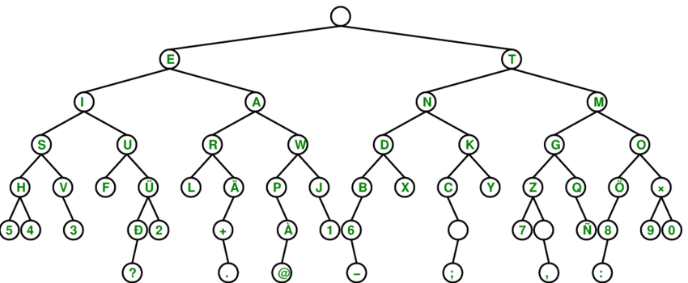

# Signs, Signals, and Codes

Tyler Akins

<table width="30%"><tr><td>

</td></tr></table>

Notes:

BRING THE CODE SHEET!
Bring merit badge pamphlet.
Bring plenty of paper for people to use.
Bring braille encoder and cardstock.
Bring topographical map.

---

## Who am I?

Tyler Akins

Website on pencil-and-paper ciphers

612-387-8102  
fidian@rumkin.com

Email is for adults and for Scouts that have a current Cyber Chip.
<!-- .element style="color: red" -->

---

## Importance

1: Discuss with your counselor the importance of signs, signals, and codes, and why people need these different methods of communication. Briefly discuss the history and development of signs, signals, and codes.

----

What are signs, signals, and codes?

How are they used?

When did they first get used?

---

## Emergency Communications

2: Explain the importance of signaling in emergency communications. Discuss with your counselor the types of emergency or distress signals one might use to attract airborne search-and-rescue personnel if lost in the outdoors or trying to summon assistance during a disaster. Illustrate these signaling examples by the use of photos or drawings.

----

<table><tr><td>

</td></tr></table>

----

<!-- .slide: data-background="air-seeing-signal.jpg" -->

---

## Codes

3a. Describe what Morse code is and the various means by which it can be sent. Spell your first name using Morse code. Send or receive a message of six to 10 words using Morse code.

3b. Describe what American Sign Language (ASL) is and how it is used today. Spell your first name using American Sign Language. Send or receive a message of six to 10 words using ASL.

----

<table><tr><td>

</td></tr></table>

----

<table><tr><td>

</td></tr></table>

----

<table width=90%><tr><td>

</td></tr></table>

---

## Semaphore (Part 1)

4: Give your counselor a brief explanation about semaphore, why it is used, how it is used, and where it is used. Explain the difference between semaphore flags and nautical flags.

----

<table><tr><td>

</td></tr></table>

----

## Semaphore (Part 2)

4a: Spell your first name using semaphore. Send or receive a message of six to 10 words using semaphore.

4b: Using illustrations or photographs, identify 10 examples of nautical flags and discuss their importance.

Notes:

Bucky states that Scouts need to come prepared for 4b.

----

<table><tr><td>

</td></tr></table>

---

## Braille (Part 1)

5: Explain the braille reading technique and how it helps individuals with sight impairment to communicate. Then do the following:

----

## Braille (Part 1)

5a: Either by sight or by touch, identify the letters of the braille alphabet that spell your name. By sight or touch, decode a braille message at least six words long.

5b: Create a message in braille at least six words long, and share this with your counselor.

----

<table><tr><td>

</td></tr></table>

---

## Sounds

6a: Describe to your counselor six sound-only signals that are in use today. Discuss the pros and cons of using sound signals versus other types of signals.

6b: Demonstrate to your counselor six different silent Scout signals. Use these Scout signals to direct the movements and actions of your patrol or troop.

----

<table><tr><td>

</td></tr></table>

---

## Trail Signs

7: On a Scout outing, lay out a trail for your patrol or troop to follow. Cover at least one mile in distance and use at least six different trail signs and markers. After the Scouts have completed the trail, follow no-trace principles by replacing or returning trail markers to their original locations.

----

<table width="70%"><tr><td>

</td></tr></table>

---

## Signals

8: For THREE of the following activities, demonstrate five signals each. Tell what the signals mean and why they are used:

8a: Sports officials hand signs/signals

8b: Heavy-equipment operators hand signals

8c: Aircraft carrier catapult crew signals

8d: Cyclists hand signals

8e: An activity selected by you and your counselor

Notes:

Bucky says Scouts should come prepared in order to get this signed off.

---

## Examples (Part 1)

9: Share with your counselor 10 examples of symbols used in everyday life. Design your own symbol. Share it with your counselor and explain what it means.

Notes:

Bucky says this should be prepared before class.

----

## Examples (Part 2)

9a: Show examples of 10 traffic signs and explain their meaning.

9b: Using a topographical map, explain what a map legend is and discuss its importance. Point out 10 map symbols and explain the meaning of each.

9c: Discuss text-message symbols and why they are commonly used. Give examples of your favorite 10 text symbols or emoticons. Then see if your counselor or parent can identify the meaning or usage of each symbol.

---

## Ciphers and Cryptography

10: Briefly discuss the history of secret code writing (cryptography). Make up your own secret code and write a message of up to 25 words using this code. Share the message with a friend or fellow Scout. Then share the message and code key with your counselor and discuss the effectiveness of your code.

---

# THE END

### Thank you!

*You survived!* <!-- .element style="font-size: 0.6em" -->

----

## Thanks for working on the Programming Merit Badge

Tyler Akins

612-387-8102  
fidian@rumkin.com

Email is for adults and for Scouts that have a current Cyber Chip. <!-- .element style="color: red" -->

Handout is available online at [https://github.com/fidian/presentations/programming-merit-badge](https://github.com/fidian/presentations/programming-merit-badge)
