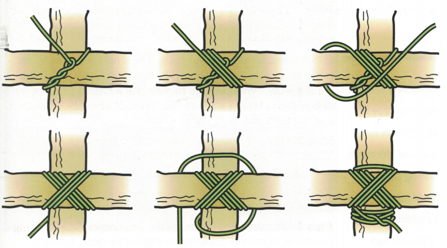
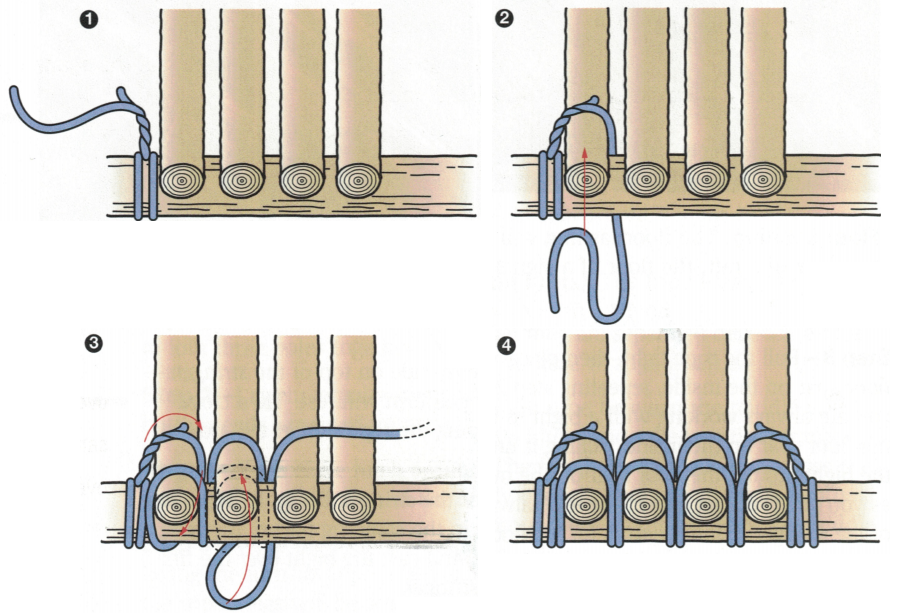

# Pioneering Merit Badge

Tyler Akins

<table width="30%"><tr><td>

</td></tr></table>

Notes:

Bring pioneering kit!

---

## Who am I?

Tyler Akins

Pioneering Merit Badge Counselor

612-387-8102  
fidian@rumkin.com

Email is for adults and for Scouts that have a current Cyber Chip.
<!-- .element style="color: red" -->

----

## Who am I?

Learned and used knots at an early age.

Father owned a nursery and tree care business.

Lived in a woods and built structures.

----

<!-- .slide: data-background="igkt-logo.png" data-background-size="contain" -->

A worldwide association for people with an interest in knots and knot tying. <!-- .element: style="background-color: #ffffffaf" -->

----

Working on earning the world record for the smallest nautical knot board.

<table style="width: 30%"><tr><td align=center>

</td></tr></table>

---

## What is Pioneering?

Can anyone here define it?

Why does the BSA promote it since its start in 1911?

Notes:

Problem solving skills, teamwork.

----

<!-- .slide: data-background="pioneering-example1.jpg" data-background-size="contain" -->

----

<!-- .slide: data-background="catapult.jpg" data-background-size="contain" -->

----

<!-- .slide: data-background="battering-ram-gate.jpg" data-background-size="contain" -->

----

<!-- .slide: data-background="pioneering-example2.jpg" data-background-size="contain" -->

----

## Dictionary Definition

> (adj) involving new ideas or methods. "his pioneering work on consciousness"

> (adj) relating to or being a pioneer, especially characteristic of early settlers or their time.

----

## Wikipedia: Pioneering (scouting)

The art of using ropes and wooden spars joined by lashings and knots to create a structure, from camp gadgets to bridges and towers.

Name comes from 18th and 19th century military engineers who went ahead of an army to "pioneer" a route, which could involve building bridges and towers with rope and timber.

---

## Safety (Part 1)

1a: Explain to your counselor the most likely hazards you might encounter while participating in pioneering activities and what you should do to anticipate, help prevent, mitigate, and respond to these hazards.

----

## Safety (Part 2)

1b: Discuss the prevention of, and first aid treatment for, injuries and conditions that could occur while working on pioneering projects, including rope splinters, rope burns, cuts, scratches, insect bites and stings, hypothermia, dehydration, heat exhaustion, heatstroke, sunburn, and falls.

----

## Guide to Safe Scouting

Pioneering projects, such as monkey bridges, have a maximum height of 6 feet. Close supervision should be followed when Scouts are building or using pioneering projects.

Safe Swim Defense applies to other nonswimming activities whenever participants enter water over knee deep or when submersion is likely, for example, when fording a stream, seining for bait, or constructing a bridge as a pioneering project.

---

## Pay Attention to Details

People get knots wrong all the time.

Even experts.

It's okay.

Be patient. Take your time.

Carefully confirm each step.

----

It's okay to get things wrong!

> Wrong ≠ Bad <!-- .element: style="font-size: 2em" -->

You just didn't succeed ***yet***.

Notes:

It took me until I was 15 until I understood it and stopped tying slipped granny knots.

----

<table><tr><td colspan=2 align=center>

Naming Knots - this is just the "Carrick Bend" because there's no "Single Carrick Bend".

</td></tr><tr><td align=center>

BSA's "Forty Knots" card (97% correct)

</td><td align=center>

Ashley Book of Knots

</td></tr></table>

Notes:

Define: STANDING / WORKING END

Can you see which ends are working ends?

----

<table><tr><td align=center>

BSA's "Forty Knots" card (95% correct)

</td><td align=center width="50%">

"Sailor's Knot" isn't really found anywhere else. It's really a "cow hitch" or "reversed half hitches."

</td><td align=center>

Ashley Book of Knots

</td></tr></table>

Notes:

This is a variant of a Lark's Head.

Animals are tethered with it because it comes undone with frantic pulling. Sailors won't use this.

----

## If names are hard, what about the knots themselves?

> Surely the BSA can get them right!

----

Midshipman's Knot or Rolling Hitch

<table><tr><td align=center>

</td><td align=center>

BSA's Forty Knots card (wrong, 90% correct)

</td><td align=center>

</td></tr><tr><td align=center>

</td><td align=center>

Ashley Book of Knots

</td><td align=center>

</td></tr></table>

Notes:

Midshipman's Hitch is tied onto a rope. Rolling hitch is tied to a spar.

----

Anchoring, Pioneering merit badge pamphlet

<table><tr><td align=center>

2009: top is a half hitch, bottom is a cow hitch with seizing

</td><td align=center>

2019: neither are knots and both look more like springs

</td></tr></table>

Notes:

Define ROUND, TURN, ROUNDTURN

----

<table><tr><td align=center>

 
2009 (Wrong) 

</td><td align=center>

 
2019 (Right)

</td></tr></table>

Lashings, Pioneering merit badge pamphlet

Notes:

Fraps are wrong.

----

<table><tr><td align=center>

 
2009 (Wrong)

</td><td align=center>

 
2019 (Right)

</td></tr></table>

Lashings, Pioneering merit badge pamphlet

Notes:

Insufficient detail, picture shows two rows and diagram implies a single loop.

----

<table><tr><td align=center>

 
2009 (Wrong)

</td><td align=center>

 
2019 (Right)

</td></tr></table>

Lashings, Pioneering merit badge pamphlet

Notes:

Don't weave over/under. Go around the three spars and frap to tighten. The spars should all go out the same side, not alternate.

----

# Why show this?

Really little details mean a lot with a knot.

Even experts and paid professionals get it wrong.

----

<!-- .slide: data-background="quiz-time.jpg" data-background-size="contain" -->

----

<table><tr><td colspan=2 align=center>

Figure eight on a bight, Pioneering merit badge pamphlet, 2009 (left) vs 2019 (right).

**Where is the difference?**

</td></tr><tr><td align=center>

</td><td align=center>

</td></tr></table>

----

Did you notice this? Compare the crossings.

The left one is wrong.

<table><tr><td align=center>

</td><td align=center>

</td></tr></table>

----

## What can we learn?

1. Pay close attention.

2. Take your time

3. You'll make mistakes. It's okay.

---

## Rope Construction

Fibers are twisted together to make yarns. 
Yarns are twisted together to make strands. 
Strands are twisted together to make rope.

----

<!-- .slide: data-background="strands-yarns.jpg" data-background-size="contain" -->

Notes:

Define: S twist vs Z twist.

Thinner yarns can be twisted together to make plied yarns.

----

## Twisted vs Braided

Braided rope can be hollow.

Braided rope can have strands inside. Those may be twisted, braided, or straight.

The braided jackets provide protection for the core.

----

<!-- .slide: data-background="twisted-vs-braided.jpg" data-background-size="contain" -->

Notes:

Forgive the British English spelling.

---

## Rope Types

4: Explain the differences between synthetic ropes and natural-fiber ropes. Discuss which types of rope are suitable for pioneering work and why. Include the following in your discussion: breaking strength, safe working loads, and the care and storage of rope.

----

<!-- .slide: data-background="types-of-rope.jpg" data-background-size="contain" -->

Notes:

Nylon stretches. Sisal kinks (super bad) when wet. Natural fibers swell and shrink when wet and may need to be stretched before use. Synthetics slip and different knots might need to be used. Polypropylene loses strength when exposed to the sun. Polyethylene develops permanent kinks. Cotton and jute are weaker than most others.

----

<!-- .slide: data-background="rope-comparison.png" data-background-size="contain" -->

Notes:

Nylon is a clear champion for most. Paracord and climbing ropes use sheathed nylon to combat two major weaknesses.

----

<!-- .slide: data-background="quiz-time2.jpg" data-background-size="contain" -->

----

What type of rope is best for boat anchors, water skiing, and towing innertubes on the water?

<table><tr><td align="center">

Polypropylene 
Polyester 
Nylon

</td><td align="center">

Cotton 
Sisal 
Jute 
Manila

</td></tr></table>

----

What type of rope is best for boat anchors, water skiing, and towing innertubes on the water?

**Polypropylene**

> Polypropylene and polyethylene float and are resistant to chemicals.

----

What type of rope is best for climbing?

<table><tr><td align="center">

Polypropylene 
Polyester 
Nylon

</td><td align="center">

Cotton 
Sisal 
Jute 
Manila

</td></tr></table>

----

What type of rope is best for climbing?

**Nylon**

> Highly resistant to shocks, high strength, low weight, rot proof, resists chemicals.

----

What type of rope is best for pioneering?

<table><tr><td align="center">

Polypropylene 
Polyester 
Nylon

</td><td align="center">

Cotton 
Sisal 
Jute 
Manila

</td></tr></table>

----

What type of rope is best for pioneering?

**Manila** - **Sisal** - **Polyester**

Notes:

> Manila is best, sisal is good, jacketed polyester can work. These projects require high strength, low stretch, resistance to abrasion, and resistance to the sun's UV rays.

----

What should you do with ropes with kinks?

----

What should you do with ropes with kinks?

> Do not use them for load-sensitive projects. They are compromised.

----

Climbing ropes come labeled with dates.

What should you do with an old climbing rope?

----

Climbing ropes come labeled with dates.

What should you do with an old climbing rope?

> Do not use it for climbing!

---

## Fundamentals (Part 2)

2b: Demonstrate how to tie the following knots: clove hitch, butterfly knot, roundturn with two half hitches, rolling hitch, water knot, carrick bend, sheepshank, and sheet bend.

----

<!-- .slide: data-background="clove-hitch.jpg" data-background-size="contain" -->

----

<!-- .slide: data-background="butterfly-knot.jpg" data-background-size="contain" -->

----

<!-- .slide: data-background="butterfly-knot2.png" data-background-size="contain" -->

----

<!-- .slide: data-background="round-turn-and-two-half-hitches.jpg" data-background-size="contain" -->

----

<table><tr><td>

Attaching to a pole or rod

</td></tr></table>
<table><tr><td>

Attaching to another rope

</td></tr></table>

----

<!-- .slide: data-background="water-knot.jpg" data-background-size="contain" -->

----

<!-- .slide: data-background="carrick-bend.jpg" data-background-size="contain" -->

----

<!-- .slide: data-background="sheepshank.jpg" data-background-size="contain" -->

----

<!-- .slide: data-background="sheet-bend.jpg" data-background-size="contain" -->

---

## Eight Knot Contest

Do you know your knots?

----

<!-- .slide: data-background="eight-knot-contest-normal.png" data-background-size="contain" -->

----

<!-- .slide: data-background="eight-knot-contest-pioneering.jpg" data-background-size="contain" -->

---

## Fundamentals (Part 1)

2a: Demonstrate the basic and West Country methods of whipping a rope. Fuse the ends of a rope.

----

<!-- .slide: data-background="common-whipping.gif" data-background-size="contain" -->

----

<!-- .slide: data-background="west-country-whipping.png" data-background-size="contain" -->

----

<!-- .slide: data-background="fuse-rope.jpg" data-background-size="contain" -->

---

## Making Rope

6: Using a rope-making device or machine, make a rope at least 6 feet long consisting of three strands, each having three yarns. Whip the ends.

----

<!-- .slide: data-background="construction-of-rope.gif" data-background-size="contain" -->

Notes:

Fibers or yarn

Strands or cordage

Rope

----

<!-- .slide: data-background="rope-making-machine.gif" data-background-size="contain" -->

----

<table><tr><td>

</td><td>

</td></tr></table>

----

<table><tr><td>

</td><td>

</td></tr></table>

----

<!-- .slide: data-background="braided-rope-making-machine.gif" data-background-size="contain" -->

----

<!-- .slide: data-background="rope-spinner.jpg" data-background-size="contain" -->

----

<!-- .slide: data-background="make-rope.jpg" data-background-size="contain" -->

Notes:

Traveler on far side because rope will shorten the cordage to about 70% of starting length. Traveler can twist manually or have a swivel.

Spacer is replaced later with a "top".

----

<video controls>
    <source src="making-rope.mp4" type="video/mp4">
</video>

[YouTube](https://www.youtube.com/watch?v=D5F2EcCsNCE) - Rope Making Machine by Johnny Debt

---

## Splices

5: Explain the uses for the back splice, eye splice, and short splice. Using 1/4- or 3/8-inch three-stranded rope, demonstrate how to form each splice.

----

<!-- .slide: data-background="toggle-rope.jpg" data-background-size="contain" -->

Notes:

The toggle rope was used by British Commandos and Paratroopers during World War II.

----

<!-- .slide: data-background="back-splice.jpg" data-background-size="contain" -->

----

<!-- .slide: data-background="eye-splice.jpg" data-background-size="contain" -->

----

<!-- .slide: data-background="short-splice.jpg" data-background-size="contain" -->

---

## Fundamentals (Part 3)

2c: Demonstrate and explain when to use the following lashings: square, diagonal, round, shear, tripod, and floor lashing.

----

<!-- .slide: data-background="square-lashing.jpg" data-background-size="contain" -->

----

<!-- .slide: data-background="diagonal-lashing.jpg" data-background-size="contain" -->

----

<!-- .slide: data-background="round-lashing.jpg" data-background-size="contain" -->

----

<!-- .slide: data-background="shear-lashing.jpg" data-background-size="contain" -->

----

<!-- .slide: data-background="tripod-lashing.jpg" data-background-size="contain" -->

----

<!-- .slide: data-background="floor-lashing.jpg" data-background-size="contain" -->

---

## Throwing Rope

3: Explain why it is useful to be able to throw a rope, then demonstrate how to coil and throw a 40-foot length of 1/4- or 3/8-inch rope. Explain how to improve your throwing distance by adding weight to the end of your rope.

----

<!-- .slide: data-background="coil-rope.jpg" data-background-size="contain" -->

----

<!-- <table><tr><td> -->

<!-- </td><td> -->

Split the coil in two. Throw your right hand coil first underhand. Follow with throwing left half or letting coils fly from left hand. The rope will go much farther.

<!-- </td></tr></table> -->

---

## Anchoring

7: Explain the importance of effectively anchoring a pioneering project. Describe to your counselor the 1-1-1 anchoring system and the log-and-stake anchoring methods.

----

<!-- .slide: data-background="1-1-1-anchoring.jpg" data-background-size="contain" -->

----

<!-- .slide: data-background="log-and-stake-anchoring.jpg" data-background-size="contain" -->

---

## Rope Tackle

8: With the approval of your counselor, demonstrate and use a rope tackle. Be sure the rope tackle is secured properly. Explain the advantages and limitations of using a rope tackle. Describe the potential damage that friction can do to a rope.

----

<table><tr><td>

</td><td>

</td><td>

</td></tr></table>

----

<!-- .slide: data-background="rope-tackle-pulling.jpg" data-background-size="contain" -->

---

## Trestle

9: By yourself, build a trestle using square and diagonal lashings. Explain why trestles are used when constructing pioneering projects.

----

<!-- .slide: data-background="trestle.jpg" data-background-size="contain" -->

---

## Project

10: With the approval of your counselor and using appropriate lashings and pioneering techniques, build and use one full-size pioneering project from either group A or group B. Your project must comply with the requirements of the Guide to Safe Scouting. (Requirement 10 may be done at summer camp, at district or council events, or on a troop camp outing.)

----

## Project (Teams)

Group A: Tower OR bridge

Anchor your project as appropriate and necessary. Explain how your anchoring system works.

Group A projects may be worked on in a group and with others.

----

<!-- .slide: data-background="rope-bridge.jpg" data-background-size="contain" -->

----

<!-- .slide: data-background="wooden-bridge.jpg" data-background-size="contain" -->

----

<table><tr><td>

</td><td>

</td></tr></table>

----

## Project (Individuals)

Group B: Camp chair OR camp table

Group B projects must be worked on individually.

----

<table><tr><td>

</td><td>

</td></tr></table>

----

<table><tr><td>

</td><td>

</td></tr></table>

---

# THE END

### Thank you!

*You survived!* <!-- .element style="font-size: 0.6em" -->

----

Tyler Akins

<table><tr><td>

12650 130th Ave N 
Dayton, MN 55327

</td><td>

612-387-8102  
fidian@rumkin.com

</td></tr></table>

Email is for adults and for Scouts that have a current Cyber Chip. <!-- .element style="color: red" -->
