<!-- .slide: data-background="bsa-logo.svg" -->

# Welcome to Scouts BSA

**And welcome to our troop!**

---

## What Is Scouting?

<table><tr><td>

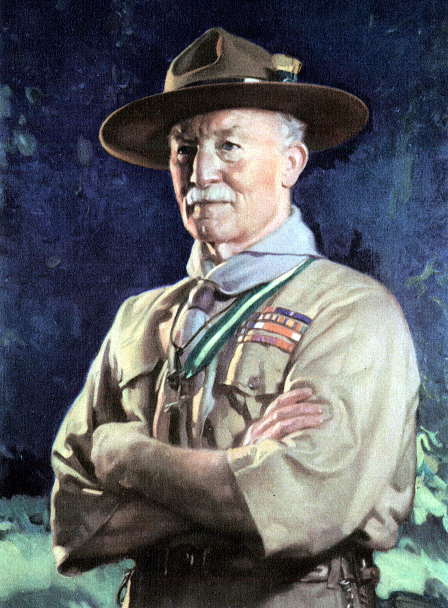

</td><td>

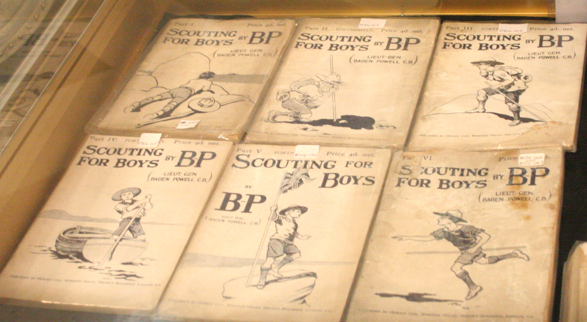

</td></tr></table>

Notes:

Started in London. Robert Baden-Powell published a series of booklets that established games and practices to make youth more fit for adventure and leadership. He thought of this program for years after trying to handle improperly trained recruits in the military.

----

## Coming to the United States

<table><tr><td width="20%">

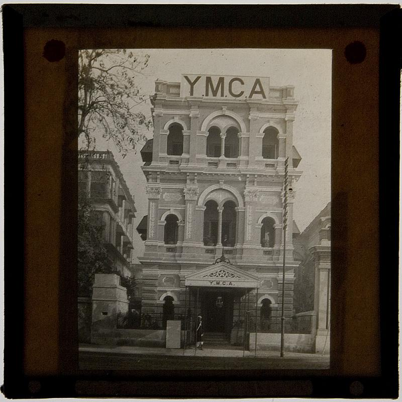

</td><td>+</td><td width="20%">

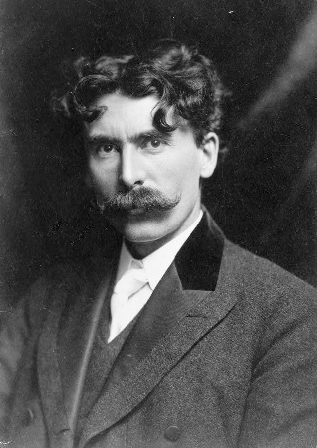

</td><td>+</td><td width="20%">

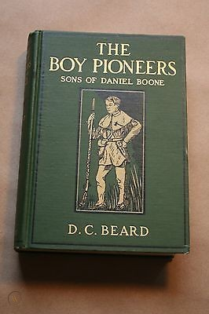

</td><td>=</td><td width="20%">

</td></tr></table>

Notes:

Turn of century had YMCA had camps, the Tribe of Woodland Indians boys' organization from Ernest Thompson Seton, and the Sons of Daniel Boone from Daniel Carter Beard. They were brought together by William Boyce, who was inspired by an unknown Scout in London. Boyce combined these into the BSA.

----

## Organization

National Council, BSA
<!-- .element: style="background-color: lightblue; border: .04em solid navy; font-size: 0.8em; width: 60%; margin: 0.5em auto" -->

Region
<!-- .element: style="background-color: lightblue; border: .04em solid navy; font-size: 0.8em; width: 60%; margin: 0.5em auto" -->

Area
<!-- .element: style="background-color: lightblue; border: .04em solid navy; font-size: 0.8em; width: 60%; margin: 0.5em auto" -->

Council
<!-- .element: style="background-color: lightblue; border: .04em solid navy; font-size: 0.8em; width: 60%; margin: 0.5em auto" -->

District
<!-- .element: style="background-color: lightblue; border: .04em solid navy; font-size: 0.8em; width: 60%; margin: 0.5em auto" -->

Chartered Organization
<!-- .element: style="background-color: lightblue; border: .04em solid navy; font-size: 0.8em; width: 60%; margin: 0.5em auto" -->

Unit Committee
<!-- .element: style="background-color: lightblue; border: .04em solid navy; font-size: 0.8em; width: 60%; margin: 0.5em auto" -->

Unit (Pack, Troop, Crew, etc.)
<!-- .element: style="background-color: lightblue; border: .04em solid navy; font-size: 0.8em; width: 60%; margin: 0.5em auto" -->

Notes:

Chartered organization owns everything that the troop owns.

----

## Aims

* Character development
* Leadership development
* Citizenship training
* Personal fitness (physical, mental, emotional)

----

## Methods

* Ideals (Oath, Law, Motto, Slogan)
* Patrols
* Outdoor programs
* Advancement
* Association with Adults
* Personal Growth
* Leadership Development
* Uniform

Notes:

75% of Scouting is outing. // Surmountable obstacles in a safe environment. // Adults are positive role models.

Doing a Good Turn helps others, but also improves yourself by building good character.

Uniform creates a positive image in the community and shows commitment to the program.

----

## Uniforms

<table><tr><td width="45%">

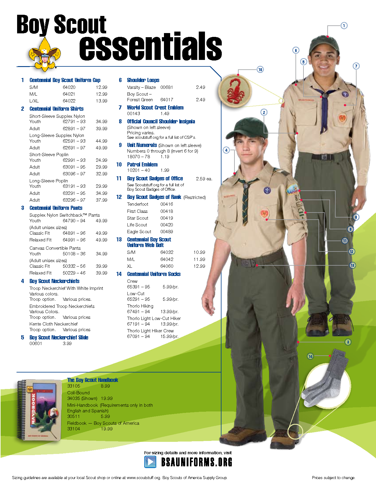

</td><td>

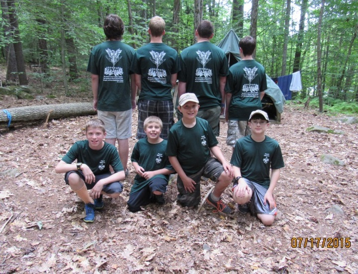

</td></tr></table>

Notes:

No official requirement. Troop expectations.

Field Uniform / Class A - Shirt and all patches, belt, pants, socks. Merit badge sash only for formal events. Activity Uniform / Class B - dark blue shirt or hoodie, used when we're working or while at camp.

---

## Transitioning from Cub Scouts

<!-- .element: style="max-width: 40%; margin: 0 auto" -->

----

<table style="font-size: 0.8em"><tr><th>

Cub Scouts

</th><th>

Scouts BSA

</th></tr><tr><td>

Family program

</td><td>

Training Scouts to be independent

</td></tr><tr><td>

Parents sign off on requirements

</td><td>

Scout leaders and Scouts sign off on requirements

</td></tr><tr><td>

Parents lead meetings and work with their own children

</td><td>

Scouts do things by themselves, parents step back

</td></tr></table>

----

## Getting Started

* Finish paperwork, pay dues
* Medical forms (Sections A, B, C)
* Scout uniform, patches, and numbers
* Scout handbook
* Get involved with the leadership
* Watch your child grow! *(It's hard!)*

----

<!-- .slide: data-background="step-back.jpg" -->

----

## Seeking Assistance

Scout asks the Patrol Leader

Patrol Leader asks the Senior Patrol Leader

Senior Patrol Leader asks the Scoutmaster or an Assistant Scoutmaster

----

## It's Time to Let Go

You want to help out, pass a message, or assist somehow. Talk to the Scoutmaster or an Assistant Scoutmaster. They will relay the information.

It's hard to watch kids struggling, but they are safe and will learn much more doing it themselves.

Notes:

Send messages through the Scoutmaster or Assistant Scoutmaster or let the youth figure it out themselves. The Scouts are in great hands.

If it's sensitive, the Scoutmaster or the Assistant Scoutmaster will go to the child directly.

----

<!-- .slide: data-background="character-training.jpg" -->

----

## When Should I Step In?

If it is a safety issue, step in immediately. This includes any form of bullying, hazing, profanity, or the threat of physical harm.
<!-- .element: style="color: red" -->

Otherwise, let them learn.

Notes:

It's hard, but your children will learn, advance, and become more independent faster. They will gain the most benefit from the Scouting program.

----

Go do it!
<!-- .element: style="color: blue" -->

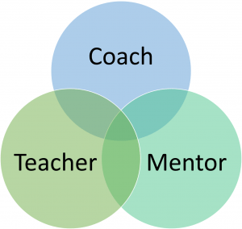

<table><tr><td width="50%">

Here's how to do it. Let me help you.
<!-- .element: style="color: green" -->

</td><td>

How do you think you'll get that done?
<!-- .element: style="color: teal" -->

</td></tr></table>

Notes:

On campouts and during troop activities, you're now a mentor. Ask exploratory and probing questions to make them think.

----

<!-- .slide: data-background="bliss.jpg" -->

<table><tr><td>

## Let us take responsibility.

You'll learn to love the freedom!

</td><td width="50%"></td></tr></table>

----

<!-- .slide: data-background="camp-chair.jpg" -->

## Camp Chair

Your new best friend.

Notes:

Scouts set up tents, dining fly, patrol box. Cook meals, clean up. Tend the fire and managing their time.

What do parents do? Great question. Mostly sit around and talk. Parents are observers. Leaders are mostly observers too.

---

## About the Program

----

## Ranks

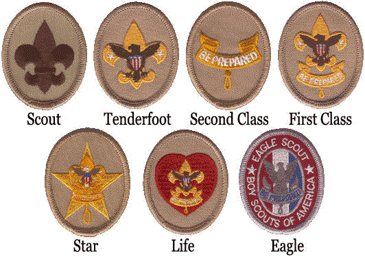

----

## Advancement Goals

* Learning by doing
* Each child progresses at their own rate
* Encourage Scouting ideals
* Parents motivate, monitor, and support (not carry) the Scout

----

## Advancement Process

Explain the skill to be learned.

Demonstrate the skill.

Guide the Scout while they perform.

Enable the Scout by letting them teach others.

*The EDGE Method*

----

## Completing Requirements

Must be met *exactly as written*

Signed off by a senior Scout or an adult leader

No double-dipping

Notes:

Can't have anything count for two requirements of the same type.

Eg. A short hike for merit badge and rank, but not two merit badges nor two ranks. A long hike can be broken up and each chunk can count for different things.

----

## Rank Advancement

Scout Spirit

Scoutmaster Conference

Board of Review

----

## Troop Structure

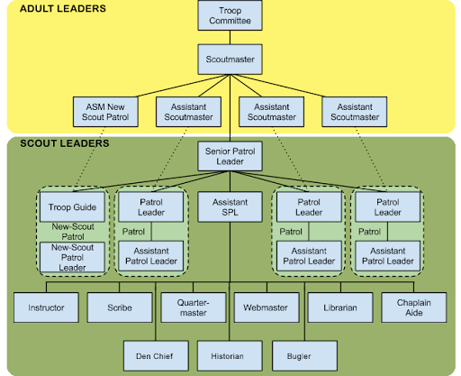

Notes:

Explain youth-led troop, which is a small democracy.

Talk about leadership positions.

Talk about patrols - teams of 4 to 10 kids. Each chooses a name, yell, and makes a flag. Camp, cook, clean, and go on activities together.

----

<!-- .slide: data-background="pop-quiz.jpg" -->

What position has the most power?
<!-- .element: style="color: white; margin-top: 33%" -->

----

<!-- .slide: data-background="pop-quiz.jpg" -->

<table style="background-color: white" width="60%"><tr><td align=center>

</td></tr></table>

Notes:

The patrol leader!

Adults facilitate.
SPL listens to patrol leaders.
Patrol leaders instructs and guides the patrol.

----

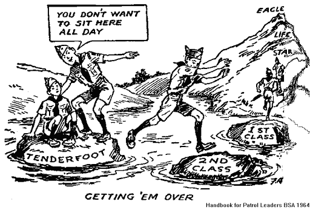

Notes:

It's also a position with a lot of responsibility. Coordinating meetings, communicating with members of the patrol, ensuring people are prepared and activities are done.

---

<!-- .slide: data-background="patches.jpg" -->

## Awards
<!-- .element: style="background-color: #ffffffaa" -->

----

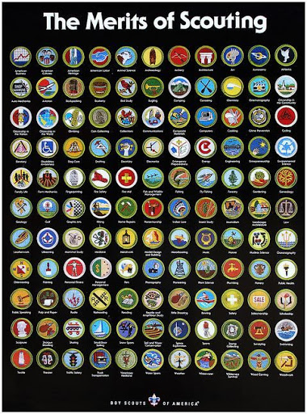

Notes:

Over 130 skills, sports, hobbies, and careers.

Some are required for advancement after First Class.

Available during camp, troop meetings, weekend outings, on their own, and during special events - Scoutmaster Bucky, Toro, University of Minnesota

----

<table><tr><td>

</td><td>

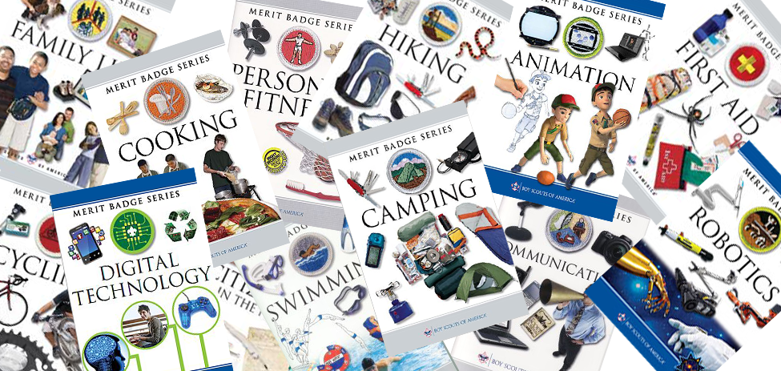

</td></tr></table>

Notes:

* Obtain a blue card with a conversation
* Contact a counselor - we can provide them
* Meet requirements exactly as written
* Obtain counselor's signature
* Turn in blue card

----

## Other Awards

<table><tr><td width="33%">

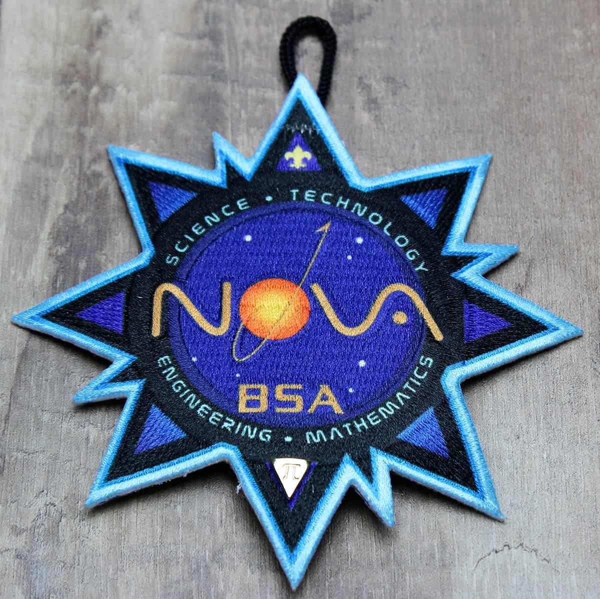

</td><td width="33%">

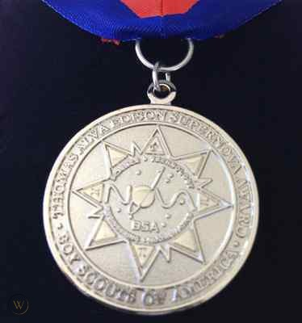

</td><td width="33%">

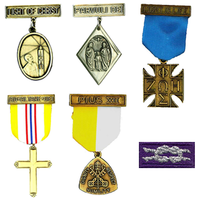

</td></tr></table>

*and many, many more*

Notes:

NOVA, SuperNOVA, Religious Emblems

---

<!-- .slide: data-background="many-point.jpg" -->

## Outings
<!-- .element: style="color: white" -->

----

## Gear

Troop: Tents, cooking equipment, dining fly
<!-- .element: style="background-color: lightgreen" -->

Patrol: Food
<!-- .element: style="background-color: lightblue" -->

Scout: Sleeping system, handbook, bathing suit, weather appropriate clothing, hiking footwear
<!-- .element: style="background-color: yellow" -->

Day Pack: rain gear, handbook, water bottle
<!-- .element: style="background-color: orange" -->

Notes:

Packing lists are available inside the handbook.

----

* Monthly, even in rain and snow
* Many Point in summer
* Adults drive
* Siblings can come only on some campouts
* Campout fees cover facilities and food
* Typically meet at church

Notes:

Adults can camp too. Adults camp with adults, but not Scouts (including your own child) because of ...

----

<!-- .slide: data-background="caution-stripes.png" -->

## Youth Protection

Required training for all adult leaders.

About 2 hours of video segments.

Can be done in a class or online.

Notes:

You'll notice that Safety is our primary concern. It's a part of everything we do.

----

<table><tr><td width="25%">

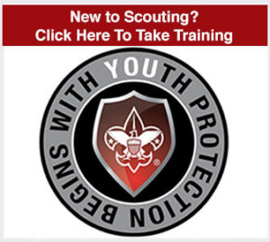

</td><td width="25%">

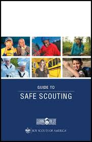

</td><td width="25%">

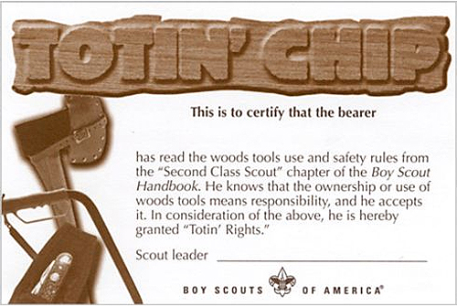

</td><td width="25%">

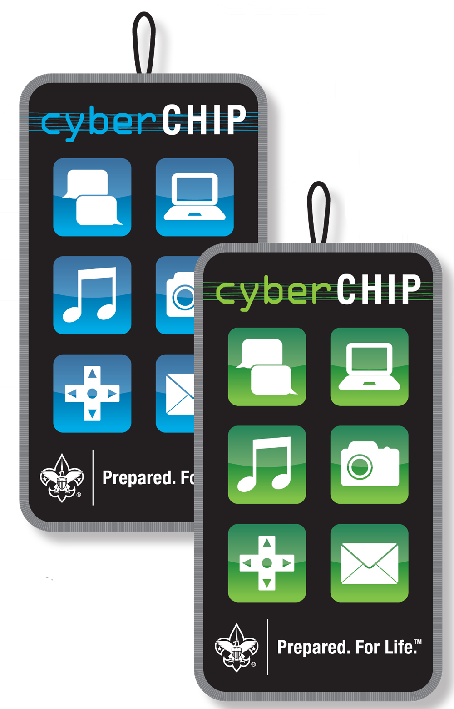

</td></tr></table>
<table><tr><td width="25%">

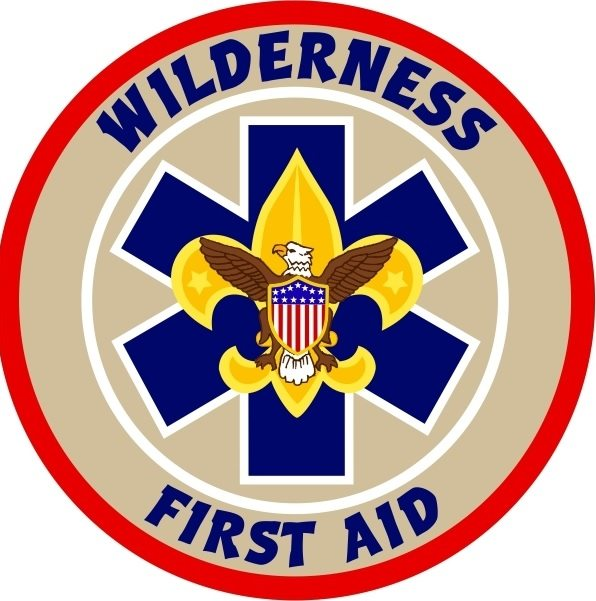

</td><td width="25%">

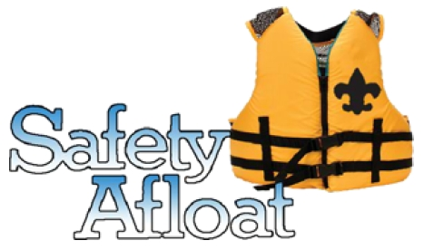

</td><td width="25%">

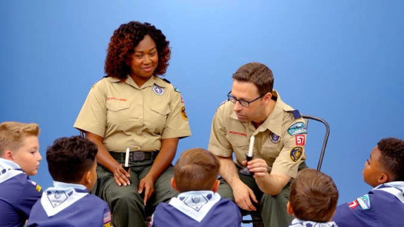

</td><td width="25%">

</td></tr></table>

Notes:

Youth Protection, Guide to Safe Scouting, Totin' Chip, Cyber Chip, Wilderness First Aid, Safety Afloat, Two-Deep Leadership, Hazardous Weather Training.

All leaders have YPT. Always two-deep leadership, no one-on-one contact. The first requirements of all merit badges are safety.

---

<!-- .slide: data-background="finish-line-ahead.png" -->

# You're almost done
<!-- .element: style="margin-left: 50%; color: white" -->

----

## We Need You

All troop leadership positions

Focused roles on the committee

Backup Scoutmaster or Assistant Scoutmaster

Notes:

Even an hour a week can make an impact. Most jobs don't require much time, especially with a lot of volunteering parents.

Children of active parents seem to get more out of the program and have more fun.

----

## Share Your Passions

Merit Badge Counselors

STEM: NOVA Counselors and SuperNOVA Mentors

----

## Adult Training

* University of Scouting
* Online videos
* Leadership classes
* CPR/AED

We can ease you into a role too.

----

## How to Start?

* Let us know
* Adult application
* Pay registration fees

----

## Most Important Info

"A game with a purpose."

Should be ***FUN!***

*Doing enjoyable, Scouting activities in a safe environment.*

----

## Making Changes

Have the topic brought up at PLC

Contact the Scoutmaster, Assistant Scoutmaster, or Senior Patrol Leader

Bring the issue to the Committee Chair

---

<!-- .slide: data-background="youre-awesome.jpg" -->
